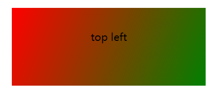
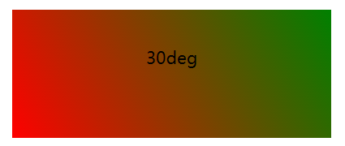
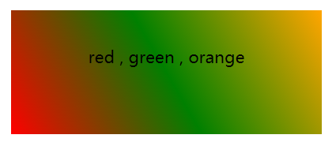
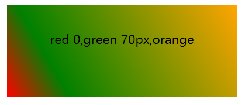
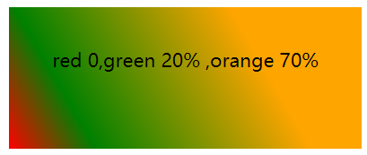
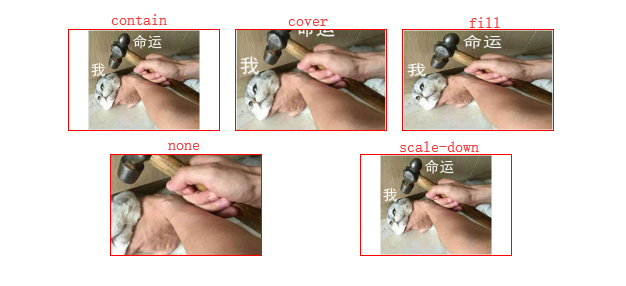

# css属性记录

此页记录一些css属性用法

## linear-gradient()

> CSS `linear-gradient()` 函数用于创建一个表示两种或多种颜色线性渐变的图片。其结果属于 [\< gradient \>](https://developer.mozilla.org/zh-CN/docs/Web/CSS/gradient)数据类型，是一种特别的 `<image>`数据类型。

::: tip
`<gradient>` 是一种`<image>` CSS数据类型的子类型，==用于表现两种或多种颜色的过渡转变。==
`<gradient>` 没有内在尺寸；即，==不具备固有或首选的尺寸==，也不具备首选的比率。其实际的大小取决于其填充元素的大小。
`<gradient>`==只能被用于`<image>`可以使用的地方==。因此，`linear-gradient()` 并不适用于background-color以及类似的使用 `<color>`数据类型的属性中。
:::

### 渐进轴线

> 线性渐变由一个轴 (梯度线) 定义，其上的每个点具有两种或多种的颜色，且轴上的每个点都具有独立的颜色。为了构建出平滑的渐变，`linear-gradient()` 函数构建一系列垂直于渐变线的着色线，每一条着色线的颜色则取决于与之垂直相交的渐变线上的色点 ; ==渐变线由包含渐变图形的容器的中心点和一个角度来定义的==。渐变线上的颜色值是由不同的点来定义，包括起始点，终点，以及两者之间的可选的中间点（中间点可以有多个）。起始点是渐变线上代表起始颜色值的点。==起始点由渐变线和过容器顶点的垂直线之间的交叉点来定义==。（垂直线跟渐变线在同一象限内）; 同样的，终点是渐变线上代表最终颜色值的点。==终点也是由渐变线和从最近的顶点发出的垂直线之间的交叉点定义==的，然而从起始点的对称点来定义终点是更容易理解的一种方式，因为终点是起点关于容器的中心点的反射点。

### 语法形式

`linear-gradient( [ <angle> | to <side-or-corner> ,]? <color-stop> [, <color-stop>]+ )`

+ 指定渐变方向：
  1. 通过 angle（角度），角度数值是以容器中心向上垂直线顺时针计算的。
  2. 通过 top | right | bottom | left 方向关键词的一个或者两个指定方向（会自动转换成角度）
+ 指定渐变线上的颜色值：
  color-stop 可以指定多个，stop可以省略，也可以用 length 或者 percentage 指定

### 例子

方向关键词指定渐进方向
`background-image: -webkit-linear-gradient(top left,red , green);`

角度值指定渐进方向
`background-image: -webkit-linear-gradient(30deg,red , green);`

指定渐进线上的多组颜色点，未指定位置点时，会默认分布
`background-image: -webkit-linear-gradient(30deg,red , green,orange);`

通过 length 来指定位置点
`background-image: -webkit-linear-gradient(30deg,red 0 , green 70px,orange);`

通过 percentage 来指定位置点
`background-image: -webkit-linear-gradient(30deg,red 0 , green 20%,orange 70%); `

## object-fit

> object-fit CSS 属性指定**可替换元素**的内容应该如何适应到其使用的高度和宽度确定的框。

可替换元素 ： \< iframe> \< video> \< embed> \< img>

### 取值
+ **contain**： 被替换的内容将被缩放，以在填充元素的内容框时保持其宽高比。 整个对象在填充盒子的同时保留其长宽比，因此如果宽高比与框的宽高比不匹配，该对象将被添加“黑边”。
+ **cover**： 被替换的内容在保持其宽高比的同时填充元素的整个内容框。如果对象的宽高比与内容框不相匹配，该对象将被剪裁以适应内容框。
+ **fill**： 被替换的内容正好填充元素的内容框。整个对象将完全填充此框。如果对象的宽高比与内容框不相匹配，那么该对象将被拉伸以适应内容框。
+ **none**： 被替换的内容将保持其原有的尺寸。
+ **scale-down**： 内容的尺寸与 none 或 contain 中的一个相同，取决于它们两个之间谁得到的对象尺寸会更小一些

### 栗子

## pointer-events

> 指定在什么情况下 (如果有) 某个特定的图形元素可以成为鼠标事件的 target。

它大部分的属性值都是针对SVG的。剩下的就只有`auto`和`none`了。

### auto
与pointer-events属性未指定时的表现效果相同，对于SVG内容，该值与visiblePainted效果相同
### none
**元素永远不会成为鼠标事件的target**。但是，当其后代元素的pointer-events属性指定其他值时，鼠标事件可以指向后代元素，在这种情况下，鼠标事件将在捕获或冒泡阶段触发父元素的事件侦听器。