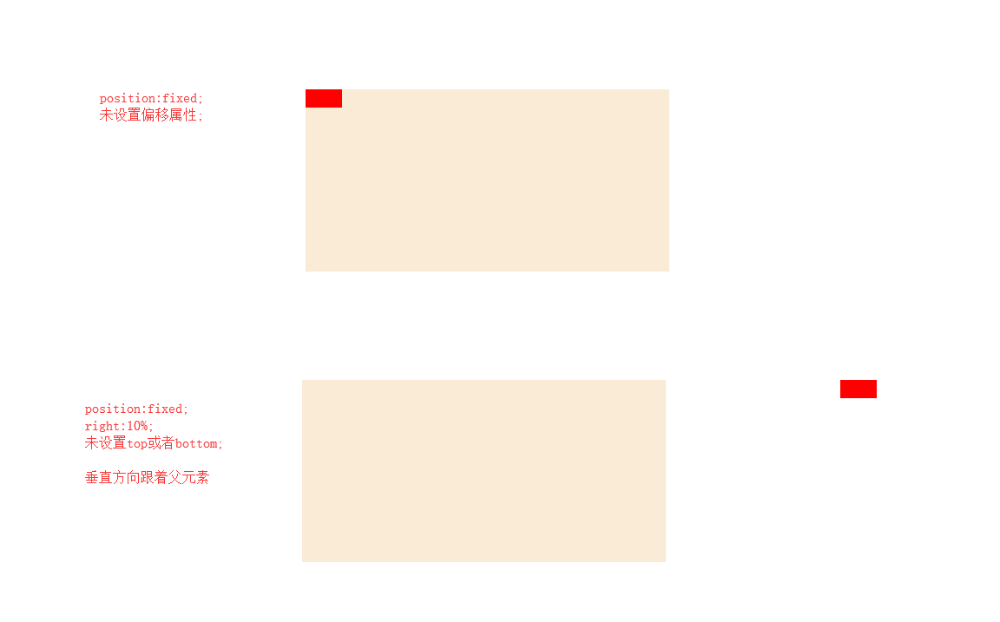
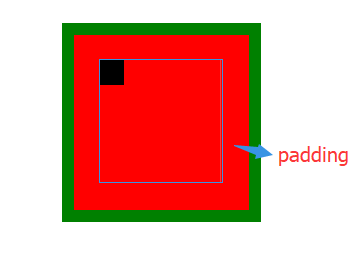
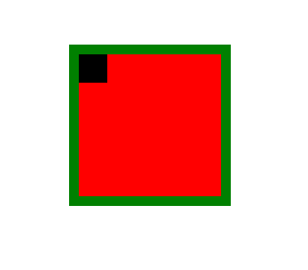
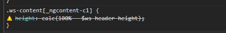
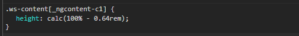

# css问题记录

 此页记录遇到过的css问题及处理方式

## 属性设置百分比时的计算参考标准是什么？
### 元素宽高
+ `width`,`min-width`,`max-width`等元素宽度设置百分比，以**包含块的宽度**为标准进行计算；
+ `height`,`min-height`,`max-height`等元素宽度设置百分比，以**包含块的高度**为标准进行计算；

### 内外边距
`margin`,`padding`设置百分比时，在默认（水平）书写模式下，以**包含块的宽度**为标准进行计算，其他情况以包含块的高度进行计算。所以正常情况下，margin-top,padding-top 等**垂直方向上的内外边距也都是以包含块的宽度**进行计算的

### 定位
+ `left`,`right`是以**包含块的宽度**为标准进行计算的；
+ `top`,`bottom`是以**包含块的高度**为标准进行计算的；

需要注意这里的包含块是和设置的`position`有关的：
+ `absolute`：对象脱离常规流，此时偏移属性参照的是离自身**最近的定位祖先元素**（position非static的元素），如果没有定位的祖先元素，则一直回溯到body元素。
+ `fixed`：对象脱离常规流，偏移定位是以**窗口**为参考

**绝对定位的元素，在top，right，bottom，left属性未设置时，会紧随在其前面的兄弟元素之后，但在位置上不影响常规流中的任何元素。**


### 字体
`font-size`设置百分比时，以**父元素的字体大小**的标准进行计算

### 行高
`line-height`设置为百分比时，是以**自身字体大小**为标准进行计算

### vertical-align
`vertical-align`设置百分比时，是以`line-height`的值为标准进行计算

### 边框圆角

`border-radius`使用百分数定义圆形半径或椭圆的半长轴，半短轴。**水平半轴相对于盒模型的宽度**；**垂直半轴相对于盒模型的高度**

### 平移变换

`translate() `即：`translatex()`,`translatey()`使用百分比定义，分别是以**自身的宽度和高度**进行计算

### 注意
> 注意：只有计算值是可以继承的。所以，即使一个百分比值用于父属性，一个真正的值，比如具体像素宽度 length 的值，将访问继承的属性，而不是百分比的值。

例如`line-height`设置百分比时，子元素继承是父元素乘以百分百之后的具体数值，所以可能会出现重叠现象。而设置为乘积因子就不会出现这种情况，子元素的行高为自身的`font-size`乘以乘积因子


## absolute和relative元素 设置百分比宽高的差异?
一般元素在页面所占的空间包括：**magin border padding content**。以前一直以为子元素设置百分比宽高都是以父元素的**content**值为基准计算的。==但是当子元素的position不同时，却是不同的结果==。

用如下小demo测试：

```
  <aside class="container">
    <div class="test">
    </div>
  </aside>

    .container{
        position: relative;
        margin: 100px auto;
        padding: 20px;
        height: 100px;
        width: 100px;
        border : 10px solid green;
        background-color: red;
    }

    .test{
        height: 20%;
        width: 20%;
        position: relative;
        top: 0;
        left: 0;
        background-color: #000000;
    }
```
此时子元素position为relative，效果如下：

<div class="img-center">
      
</div>

子元素以父元素的`content`宽度100px为基准计算的20%为20px 且是以content为参考进行的偏移（虽然这里为0）

若子元素position为absolute时，效果如下：

<div class="img-center">
      
</div>

此时子元素的百分比宽度是以 父元素的 `padding + content`的值进行计算的 为28px; 而且也是以padding为基础进行偏移的。

::: tip
　　absolute元素的百分比宽高 计算时按照的包含块的 padding + content 的值算的，偏移的参考也要加上padding那部分

　　relative元素的百分比宽高 计算时按照的包含块的 content 的值算的.
:::


## cacl()函数中使用scss变量如何生效？

使用cacl()动态计算元素的高度，运算中包含一个scss变量 `height: calc(100% - $ws-header-height);` , 在浏览器中发现并没有达到预期效果，scss变量没有被解析。

<div class="img-center">
      
</div>

**使用scss的插值语句 `#{}`** ,  `height: calc(100% - #{$ws-header-height});`  就在浏览器中正常解析了。

<div class="img-center">
      
</div>

## 父元素opacity属性对子元素有何影响？

> opacity属性指定了一个元素后面的背景的被覆盖程度;当opacity属性的值应用于某个元素上时，是把这个元素（包括它的内容）当成一个整体看待，即使这个值没有被子元素继承。因此，**一个元素和它包含的子元素都会具有和元素背景相同的透明度**，哪怕这个元素和它的子元素有不同的opacity属性值。

所以用opacity设置透明度会影响到子元素。如果想消除这种影响，可以使用**RGBA()来设置元素的背景透明度，此种设置方法不会影响子元素的透明度**。

## 块元素中的img为什么会在底部有空白？如何处理？

在 [此篇博客](https://www.zhangxinxu.com/wordpress/2015/08/css-deep-understand-vertical-align-and-line-height/) 看到了特别详细的解释。归纳下大致原因如下：

> 在HTML5文档声明下，块状元素内部的内联元素的行为表现，就好像块状元素内部还有一个（更有可能两个-前后）看不见摸不着没有宽度没有实体的空白节点，这个假想又似乎存在的空白节点，我称之为“幽灵空白节点”。

而img为内联元素，它和上文中的“幽灵空白节点”在垂直方向的默认对齐方式为 `vetical-align:baseline`。如下图：

<div class="img-center">
      
</div>

img等替换元素的baseline为 `margin`,而文字的baseline为`x`的下边沿，而文字（或者说**幽灵空白节点**）有自身的高度（受`line-height`影响），所以就会在底部有一段空白距离。

所以解决这个问题的思路有两个：
1. 改变`vertical-align`的对齐方式
2. 解决**幽灵空白节点**的高度问题

``` css
/* 方案一：改变对齐方式  middle,bottom,top都可以 */
.fix-1 {
    vertical-align:middle;
}

/* 方案二：将改为块状元素，块状元素不受vertical-align影响 */
.fix-2{
    display:block;
}

/* 方案三：处理“幽灵节点”的高度 */
.fix-3{
    font-size:0;
}
```