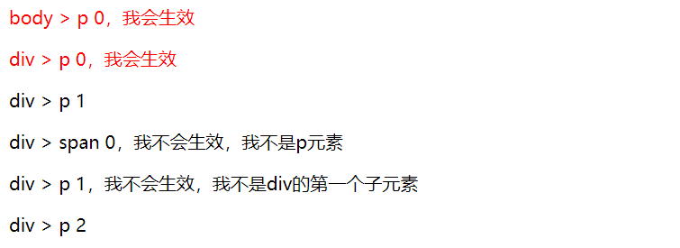

# CSS选择器
> 选择器用于定位我们想要的网页HTML元素。

汇总下便于查阅，内容来自 [MDN](https://developer.mozilla.org/zh-CN/docs/Learn/CSS/Introduction_to_CSS/Selectors)

## 简单选择器
> 通过元素类型、class 或 id 匹配一个或多个元素.
### 类型选择器
> 一个选择器名和指定的**HTML元素名**的**不区分大小写**的匹配
```css
p {color:red}
```
### 类选择器
> 类选择器由一个点`.` 以及类后面的**类名**组成。类名是在HTML **class文档元素属性**中**没有空格的任何值**

元素的class可以多个不同的属性值，只有有一个属性值与类选择器匹配即被选中

```css
.className {margin:10px}
```
### ID选择器
> ID选择器由哈希/磅符号 `#`组成，后面是给定元素的**ID名称**。 任何元素都可以使用**id属性**设置**唯一**的ID名称。
```css
#idName {padding:5px}
```
### 通用选择器
> 通用选择`*`是最终的王牌。它允许**选择在一个页面中的所有元素**。
```css
* {padding:0;margin:0}
```
## 属性选择器
> 属性选择器是一种特殊类型的选择器，它根据元素的 属性 和属性值来匹配元素。它们的通用语法由方括号 `[]`组成，其中包含**属性名称**，后跟**可选条件**以匹配属性的值。 属性选择器可以根据其匹配属性值的方式分为两类： 存在和值属性选择器和子串值属性选择器。

### 存在和值属性选择器
这些属性选择器尝试匹配精确的属性值：
+ [attr]：该选择器选择**包含attr属性**的所有元素，不论attr的值为何。
+ [attr=val]：该选择器仅选择**attr属性被赋值为val**的所有元素。
+ [attr~=val]：该选择器仅选择具有 attr 属性的元素，而且**要求 val 值是 attr 值包含的被空格分隔的取值列表里中的一个**。

有点绕口，看栗子。

```html
<ul>
    <li>li zero</li>
    <li data-test data-val="val-start">li first</li>
    <li data-test="test" data-val="valstart valmid">li second</li>
    <li data-test="test one two three" data-val="valstart valmid valend">li third</li>
</ul>
```
```css
    /* 选中所有有data-test属性的元素, 所有的li元素*/
    [data-test] {color: red}
    /* data-test属性值为“test”的元素 ， li second */
    [data-test="test"]{text-decoration: underline}
    /* data-test属性值包含有“test” 的元素 li second、li third*/
    [data-test~="test"] {font-weight: bold}
```
<div class="img-center">
    
</div>

### 子串值属性选择器

这种情况的属性选择器也被称为“伪正则选择器”，因为它们提供类似 regular expression 的灵活匹配方式（但请注意，这些选择器并不是真正的正则表达式）：

+ [attr|=val] : 选择attr属性的值是 val 或值以 val- 开头的元素（注意，这里的 “-” 不是一个错误，这是用来处理语言编码的）。
+ [attr^=val] : 选择attr属性的值以 val 开头（包括 val）的元素。
+ [attr$=val] : 选择attr属性的值以 val 结尾（包括 val）的元素。
+ [attr*=val] : 选择attr属性的值中包含子字符串 val 的元素（一个子字符串就是一个字符串的一部分而已，例如，”cat“ 是 字符串 ”caterpillar“ 的子字符串）。

和上面例子使用同样一份html结构

```css
    /*以'val-'开头，或者属性值是'val'的元素 ， 只有 li first满足*/
    [data-val|="val"] { color: red } 

    /*以'val'开头，或者属性值是'val'的元素 ， li first second third满足*/
    [data-val^="val"] { text-decoration: underline } 

    /*以'end'结尾 ， 只有 li third 满足*/
    [data-val$="end"] { font-weight: bold } 
    
    /*包含'mid'， 有 li second third 满足*/
    [data-val*="mid"] { font-size: 20px; } 
```
<div class="img-center">
    
</div>

## 伪类和伪元素选择器

### 伪类

> 一个 CSS  伪类（pseudo-class） 是一个以冒号(:)作为前缀，被添加到一个选择器末尾的**关键字**，当你希望样式**在特定状态下**才被呈现到指定的元素时，你可以往元素的选择器后面加上对应的伪类（pseudo-class）。

伪类有很多种,这里展示了一些常用的，所有的见 [MDN](https://developer.mozilla.org/zh-CN/docs/Web/CSS/Pseudo-classes) ：

关键字 | 含义 | 备注
:-- | :-- | :--
:active | 表示**被用户激活**的元素；当用鼠标交互时，它代表的是用户按下按键和松开按键之间的时间 | 这个样式可能会被后声明的其他链接相关的伪类覆盖，所有注意**添加顺序** :link — :visited — :hover — :active
:checked | 表示任何处于选中状态的radio, checkbox 或("select") 元素中的option HTML元素("option") | 可利用 :checked伪类，让用户基于复选框的状态切换内容，而无需使用JavaScript
:default | 表示一组相关元素中的默认表单元素 | 该选择器可以在 \< button>, \< input type="checkbox">, \< input type="radio">, 以及 \< option> 上使用
:dir() | 匹配特定文字书写方向的元素 | :dir() 并不等于使用 \[ dir=… \] 属性选择器
:disabled | 表示任何被禁用的元素。 | 一个元素不能被激活（如选择、点击或接受文本输入）或获取焦点，则该元素处于被禁用状态。
:empty | 代表没有子元素的元素。 | 子元素只可以是元素节点或文本（包括空格）。注释或处理指令都不会产生影响。
:enabled | 表示任何启用的元素。 | 如果一个元素能够被激活（如选择、点击或接受文本输入）或获取焦点，则该元素是启用的。
:first-child | 表示在一组兄弟元素中的第一个元素。(选取属于其父元素的首个子元素) | `E:first-child ` **E 要是其父元素的第一个子元素才会被匹配，注意并不是匹配 E 的第一个子元素**
:first-of-type | 表示一组兄弟元素中**其类型的第一个元素** | 要注意和 :first-child的区别，`E:first-of-type`匹配的是父元素的第一个 E类型 的元素
:fullscreen | 应用于当前处于全屏显示模式的元素。| Webkit和Gecko：:-webkit-full-screen 和:-moz-full-screen。Edge和Internet Explorer各自使用标准语法：:fullscreen和:-ms-fullscreen。
:focus | 表示获得焦点的元素（如表单输入） | 此伪类仅适用于焦点元素本身。如果要选择包含焦点元素的元素，请使用:focus-within 
:focus-within | 表示一个元素获得焦点，或，该元素的后代元素获得焦点。换句话说，**元素自身或者它的某个后代**匹配:focus伪类。 | 该选择器非常有用，举个通俗的例子：当用户在表单中某个\< input > 域上获得焦点，会高亮整个表单。
:hover | 适用于用户使用指示设备虚指一个元素（没有激活它）的情况。 | 在触摸屏上 :hover 有问题，基本不可用
:indeterminate | 表示状态不确定的表单元素 | \< input type="checkbox"> 元素，其 indeterminate 属性被 JavaScript设置为 true 。 ; \< input type="radio"> 元素, 表单中拥有相同 name值的所有单选按钮都未被选中时;处于不确定状态的 \< progress> 元素
:in-range | 代表一个 \< input> 元素，其当前值**处于属性min 和max 限定的范围之内**;该伪类用于给用户一个可视化的提示，表示输入域的当前值处于允许范围内。 | 该伪类仅适用于那些拥有（或可以接受）取值范围设定的元素。若缺少此类设定，元素值就无所谓“in-range”和“out-range”。
:invalid | 表示任意内容未通过验证的 \< input> 或其他 \< form> 元素  |  应该是对配置了校验规则的表单有效
:last-child | 代表父元素的最后一个子元素 | 用法和实例参考:first-child
:last-of-type | 表示了在（它父元素的）子元素列表中，**最后一个给定类型的元素** | 和`:first-of-type`同样的用法
:link | 用来选中元素当中的链接 | 它将会选中所有尚未访问的链接，包括那些已经给定了其他伪类选择器的链接（例如:hover选择器，:active选择器，:visited选择器）。为了可以正确地渲染链接元素的样式，:link伪类选择器应当放在其他伪类选择器的前面，并且遵循LVHA的先后顺序，即：:link — :visited — :hover — :active。
:not() | :not(X)，是以一个简单的以选择器X为参数的功能性标记函数。它匹配不符合参数选择器X描述的元素 | X不能包含另外一个否定选择器。
:nth-child() | 首先找到所有当前元素的兄弟元素，然后按照位置先后顺序从1开始排序，选择的结果为第（an+b）个元素的集合（n=0，1，2，3...） | 关键字 even 表示偶数 ； 关键字 odd 表示奇数 ；特殊用法 span:nth-child(-n+3) 匹配前三个子元素中的span元素
:nth-last-child() | 同`:nth-child()`的用法一样，不过是**从结尾处开始计数** | 
:nth-last-of-type() | 基本上和 `:nth-of-type` 一样，只是它从结尾处反序计数，而不是从开头处
:nth-of-type() | 这个选择器匹配那些在相同兄弟节点中的位置与模式 an+b 匹配的**相同元素** | 注意与`:nth-child()`的差别，这个计算个数的时候，只算相同类型的元素
:only-child | 代表了属于某个父元素的唯一一个子元素 | 等效的选择器还可以写成 :first-child:last-child或者:nth-child(1):nth-last-child(1)
:only-of-type | 代表了任意一个元素，这个元素没有其他相同类型的兄弟元素
:optional | 表示任意没有required属性的 <input>，<select> 或  <textarea> 元素 | 它允许表单容易的展示可选字段并且渲染其外观。
:out-of-range | 表示一个 \< input> 元素，其当前值**处于属性 min 和 max 限定的范围外**。 | 该伪类用于给用户一个可视化的提示，表示输入域的当前值处于允许范围外。
:read-only |  表示元素不可被用户编辑的状态（如锁定的文本输入框）| 这个选择器不只是选择具有 readonly 属性的<input> 元素，它也会选择所有的不能被用户编辑的元素。
:read-write | 代表一个元素（例如可输入文本的 input元素）可以被用户编辑 | 这个选择器不仅仅选择 <input> 元素，它也会选择所有可以被用户编辑的元素，例如设置了 contenteditable 属性的  <p> 元素。
:required | 表示 任意 <input> 元素表示任意拥有required属性的 <input> 或 <textarea> 元素 |  它允许表单在提交之前容易的展示必填字段并且渲染其外观
:right | 
:root | 
:scope | 
:target | 
:valid | 
:visited | 

下面是一些例子：

#### :first-child 例子
```html
    <p>body > p 0，我会生效</p>
    <div>
        <p>div > p 0，我会生效</p>
        <p>div > p 1</p>
    </div>
    <div>
        <span>div > span 0，我不会生效，我不是p元素</span>
        <p>div > p 1，我不会生效，我不是div的第一个子元素</p>
        <p>div > p 2</p>
    </div>
```
```css
    p:first-child{ color: red; }
```
此样式选择器匹配成功的条件是：**p**元素是**其父元素**的**第一个子元素**；

<div class="img-center">
    
</div>

#### :first-of-type 例子
```html
    <p>body > p 0，我会生效,我是body的第一个p元素</p>
    <div>
        <span>div > span 0，我不会生效，我是span元素而不是p元素 </span>
        <p>div > p 1，我会生效，我是div的第一个p元素</p>
        <p>div > p 2，我不会生效，我不是第一个p元素</p>
    </div>
```
```css
    p:first-of-type{ color: red; }
```
<div class="img-center">
    
</div>

#### :not  例子

```html  
    <div class="parent">
        <p>第一行</p>
        <p>第二行</p>
        <p>第三行</p>
        <p>第四行</p>
    </div>
```
```css
    p:not(:last-child){
        border-bottom: 1px solid #ccc;
    }
```

<div class="img-center">
    
</div>
最后一个p元素不生效

#### :nth-child() nth-last-child  例子

```html  
    <div class="parent">
        <p>第一个p元素</p>
        <p>第二个p元素</p>
        <p>第三个p元素</p>
        <p>第四个p元素</p>
        <div>我是div元素</div>
        <p>第五个p元素</p>
        <p>第六个p元素</p>
        <p>第七个p元素</p>
    </div>
```
```css
    p:nth-child(odd) {
        color: red;
    }

    p:nth-child(3n + 1) {
        font-weight: 600;
    }

    p:nth-child(-n + 3) {
        text-decoration: underline;
    }
    p:nth-last-child(-n + 3) {
        text-decoration: line-through;
    }

    .parent :nth-child(odd){
        font-size:28px;
    }
```

<div class="img-center">
    
</div>

注意兄弟元素中有一个div元素，所以`p:nth-child(odd)`匹配时，第五个p元素没有生效，它对应的排序是第6位;**它的判断规则是，匹配第5个元素**，因为加了`p:` 而第五个是`div`,所以不会生效。

而`.parent :nth-child(odd)`就会对`div`生效。

`nth-child(-n + 3)`这种方式可以指定前三个元素；同理，`:nth-last-child(-n + 3)`这种方式可以指定后三个元素

#### :nth-last-child() 例子

```html  
    <div class="parent">
        <p>第一行</p>
        <p>第二行</p>
        <p>第三行</p>
        <p>第四行</p>
    </div>
```
```css
    p:not(:last-child){
        border-bottom: 1px solid #ccc;
    }
```

<div class="img-center">
    
</div>
最后一个p元素不生效

#### :nth-child() nth-last-child  例子

```html  
    <div class="parent">
        <p>第一个p元素</p>
        <p>第二个p元素</p>
        <div>我是第一个div元素</div>
        <div>我是第二个div元素</div>
        <p>第三个p元素</p>
        <p>第四个p元素</p>
        <div>我是第三个div元素</div>
        <div>我是第四个div元素</div>
    </div>
```
```css
    p:nth-of-type(2),div:nth-of-type(2) {
        color: red;
    }

    .parent :nth-of-type(odd){
        font-size:28px;
    }
```

<div class="img-center">
    
</div>

`nth-of-type`是选中该类型的第几个 所以`.parent :nth-of-type(odd)`，div下面，奇数个p和奇数个的div都会生效。 如果是`.parent :nth-child(odd)`,则是奇数个子元素会生效，不会按照类型分别计算

### 伪元素