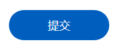
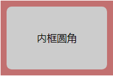
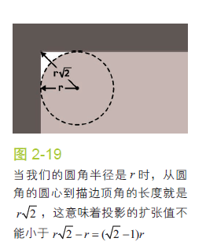

# CSS技巧记录

此页记录常用的css技巧，会不断收集和更新！

## 清除浮动

> 当一个元素浮动之后，它会被**移出正常的文档流**，然后向左或者向右平移，一直平移直到碰到了所处的容器的边框，或者碰到另外一个浮动的元素。

`float`元素移除文档流后，就不会再参与撑开父元素，**可能会导致父元素高度异常**（其他非浮动子元素高度没有浮动元素大的情况下），引发各种问题。

+ overflow:hidden

```css
  .clearfloat{
         overflow: hidden;
         *zoom : 1; 
   }
```
父元素设置`overflow`属性之后，浮动元素回到父元素中，会撑开高度。
这里设置了`zoom`的值，是为了兼容IE6。

+ clear:both

```css
    .clearfloat::after{
      content: " ";
      display: block;
      clear: both;
      height: 0;
      visibility: hidden;
    }
```

## 半圆边框

实现这种效果

<div class="img-center">
    
</div>

``` css
    .semi-circle{
        border-radius: 100rem;
    }
```
设置`border-radius`的值为高度的一半即可实现半圆效果，但是元素高度变化时，需要一起调整；如果设置`border-radius`的值大于高度的一半，发现也不会有任何变化，还是半圆效果。
所以可以设置`border-radius`的值为一个**较大值**（比如这里的100rem），**无需再跟随属性变化做调整**。

## 内框圆角

实现这种效果

<div class="img-center">
    
</div>

``` css
    .inner-radius{
        border-radius: 8px;
        outline: 10px solid rgb(194, 112, 112); 
        box-shadow: 0 0 0 5px rgb(194, 112, 112);
    }
```

`outline`用来设置外层矩形轮廓，它不会受到圆角属性的影响；`box-shadow`属性用来填充圆角处的空白，注意控制好外延值。

<div class="img-center">
    
</div>

## 文字模糊

实现这种效果

<div class="img-center">
    
</div>

```css
    .blurry-text{
        color: transparent;
        text-shadow: 0 0 5px rgba(114, 69, 69, 0.5);
    }
```

文字颜色设置为`transparent`，然后使用`text-shadow`来实现文字轮廓模糊效果

