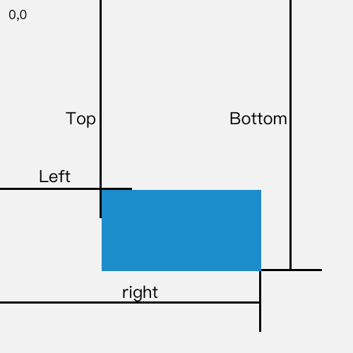
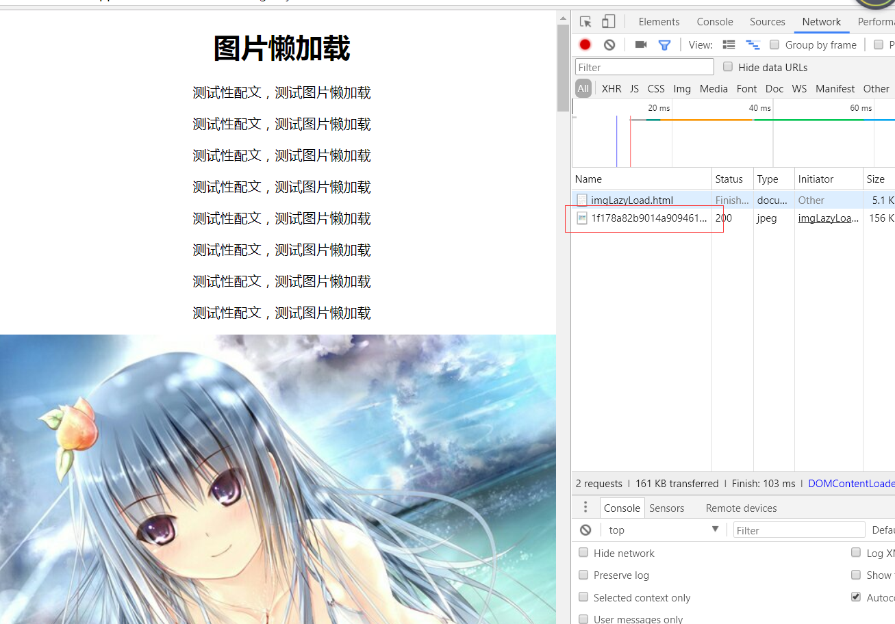
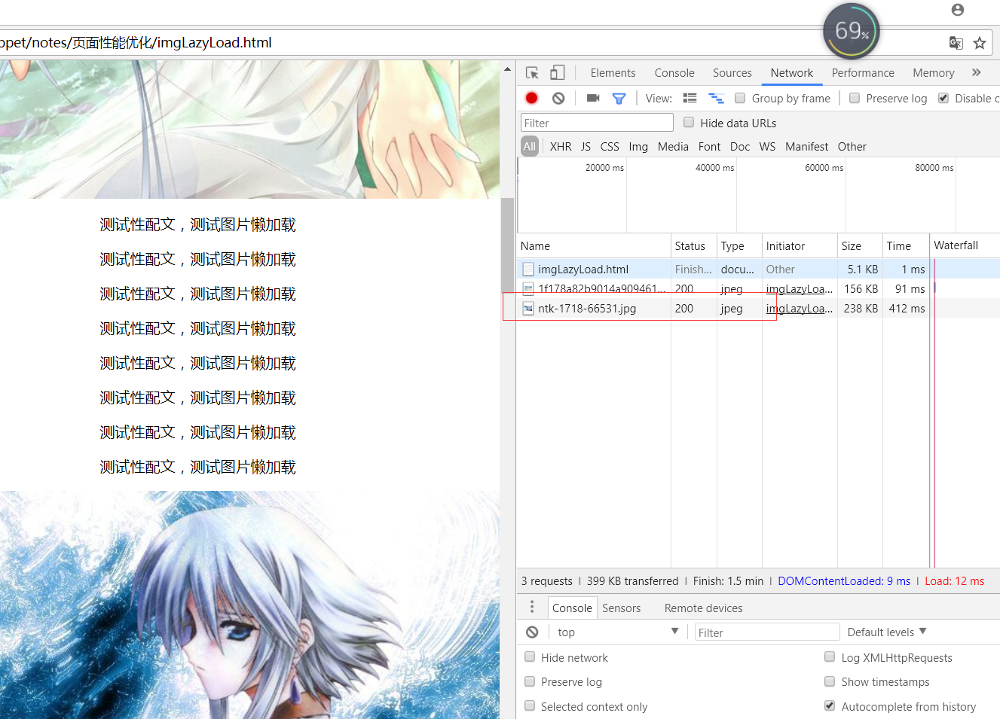

# 非首屏图片延时加载
目标:减少资源加载可以明显的优化页面加载的速度，所以可以减少页面载入时立即下载的图片的数量，以提高页面加载速度，其他的图片在需要的时候再进行加载。

思路:想要实现以上的目标，有几个地方需要思考。
1. 如何判断哪些图片需要立即加载，哪些可以晚些再加载？
2. 如何控制图片在指定的时候加载？

对于第一个问题，页面打开就会被用户看到的图片肯定需要立即加载，其他的可以延后。即在视窗中的图片需要立即加载。那么如何判断图片是否在视窗内呢？`getBoundingClientRect`可以返回元素的大小及其相对于视口的位置（[详细说明](https://developer.mozilla.org/zh-CN/docs/Web/API/Element/getBoundingClientRect)）

<div class="img-center">
    
</div>

可以通过图中top和right的值判断图片是否在视窗中。
对于第二个问题，先不给img指定src，而是将图片链接地址存放再元素的data-src属性（自定义）中，需要加载的时候再赋值给src，才会开始下载图片。

实现思路有了，我们开始实现。用以下HTML进行测试
```html
<div class="container">
    <h1>图片懒加载</h1>
<p>测试性配文，测试图片懒加载</p>   <!-- 复制若干个  -->
    
<p>测试性配文，测试图片懒加载</p>   <!-- 复制若干个  -->
    
<p>测试性配文，测试图片懒加载</p>   <!-- 复制若干个  -->
    
<p>测试性配文，测试图片懒加载</p>   <!-- 复制若干个  -->
    
<p>测试性配文，测试图片懒加载</p>   <!-- 复制若干个  -->
    
    <p>测试性配文，测试图片懒加载</p>   <!-- 复制若干个  -->
  </div>
``` 
html中链接都来自百度图片，可在network中观察是否加载，这里忽略样式。按照之前的思路，有以下代码

```js
      //所有的图片
      var imgs = document.querySelectorAll('.lazy-img');
      //首屏图片加载
      lazyLoad(imgs)
      //剩余图片加载---监听滚动事件
      window.addEventListener('scroll',function(){
        //滚动事件触发太频繁了，所以加上节流
        throttle(lazyLoad(imgs),200,500)
      })
    }
```
下面就是如何实现`lazyLoad`

```js
function lazyLoad(imgs,offset){
  offset = offset || 100;
  if (!imgs || imgs.length < 1) {
    console.log('imgs为空');
    return ;
  }
  [].slice.call(imgs).forEach(function(element,index){
    //元素的DomRect
    var rect = element.getBoundingClientRect()
    //出现在视窗中
    if (rect.top <= window.innerHeight + offset && rect.right > 0) {
      element.setAttribute('src',element.getAttribute('data-src'))
    }
  })
}
```

通过window.innerHeight获取到视窗的高度，当元素距离视窗上边沿为offset时，加载图片；其中offset为指定的偏移距离。

节流函数如下:
```js
    function throttle (fn, delay, atleast) {
      let timer = null
      let startTime = new Date()

      return function () {
        let context = this
        let args = arguments
        let curTime = new Date()

        clearTimeout(timer)
        if (curTime - startTime >= atleast) {
          fn.apply(context, args)   // apply 指定函数指向的 上下文(this) 和 参数列表
          startTime = curTime
        } else {
          timer = setTimeout(function () {
            fn.apply(context, args)
            startTime = curTime
          }, delay)
        }
      }
    }
```

页面载入完成，只加载了一张图片

<div class="img-center">
    
</div>

向下滚动到指定位置，才会依次加载后续图片

<div class="img-center">
    
</div>

　