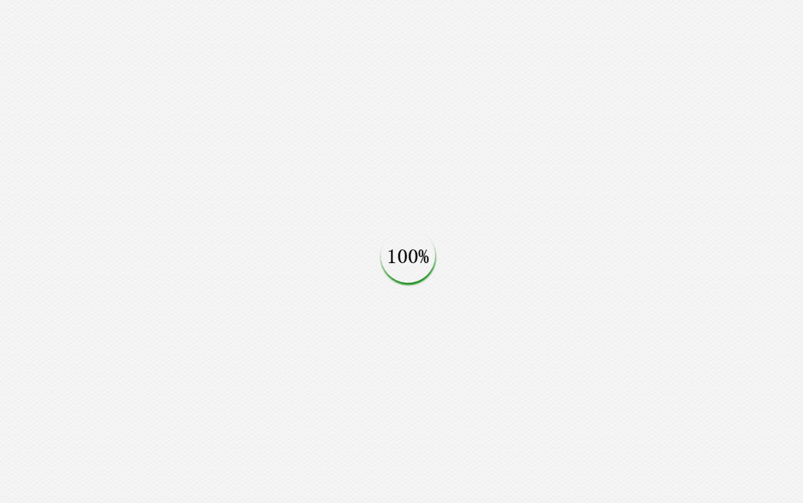

# 图片载入状态判断及实现百分比效果loading

一些大的外部资源会导致页面加载速度慢，这时候一般会加上loading效果；这里实现的是根据图片加载进度的百分比loading效果

## 如何判断图片加载的状态
1. onload  onerror 
   推荐使用这种方法，在图片加载成功后，会触发onload事件，就算有缓存只要重新请求了图片地址，都会触发onload事件；图片加载失败会触发onerror事件。这种方式兼容性良好，推荐

2. imgObj.onreadystatechange
   部分浏览器支持此种方法，根据 readState === ‘complete'可判断图片是否加载完成。
   
   测试了下：
   + chrome,firefox不会触发此事件
   + IE Edge版本 不会触发此事件
   + IE 10 9 会触发此事件；更低版本的没有测试

   所以不推荐使用 

3. imgObj.complete
   complete属性可以判断图片是否加载完成。但是不同的浏览器对complete的处理不一致：
   + 如果图片资源正常，图片加载成功  所有浏览器都是 complete从false变为true;
   + 但是如果图片资源异常，图片加载失败 chrome和firefox 在载入失败后从false变为true;但是IE 会一直是false
   所以不推荐使用这种方式。

## 图片资源加载进度
   可以判断出单个图片资源是否加载完成了，就很容易计算出整个页面所有图片资源加载的进度了。
```js
      document.addEventListener('DOMContentLoaded', function(){
        var imgs = document.querySelectorAll('img'), //所有图片资源
            show = 0, //百分比
            num = 0; //加载完成的个数
        var all = imgs.length;
        [].slice.call(imgs).forEach(function(element,index){
           //不管是否加载成功，都num+1
          element.addEventListener('load',function(){
            num++;
           show = Math.floor(100*num/all);
 
         })
 
         element.addEventListener('error',function(){
           num++;
           show = Math.floor(100*num/all);
        })
       })
   })
```
　　在加上蒙版和百分比字样，很容易实现载入的百分比效果。

<div class="img-center">
    
</div>

　　在页面全部加载完成后，再隐藏蒙版，即可实现比较友好的loading效果了
```js
    window.onload = function(){
      document.querySelector('.mask').classList.add('hide');
    }
```