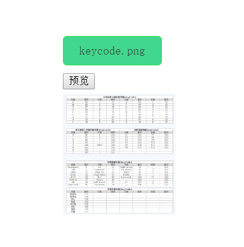

# Input样式美化、图片预览、图片上传

上传图片是常见的需求，多使用input标签，用到的知识点有：

1. input标签的使用
2. filelist对象 和 file对象
3. fileReader对象
4. formData对象

## input[type='file']样式美化

原生的input标签样式单一，且在不同浏览器下的表现还不一致。所以为了美观和统一，我们需要自定义input标签的样式。

实现的方式有很多中，这里采用的是：用一个div将input标签包裹，然后再将input标签透明度设置为0，再对div设置自己需要的样式。html和css如下：
```html
      <div class="upload-file">
        <input type="file" class="input-file" multiple="true">  // mulitiple属性控制是否允许上传多个文件
        <span class="tip">点击上传图片</span>
      </div>
```
这样点击div，其实也就点击到了input标签，可已正常触发选择文件的。

但是这样就会产生一个问题，**如何获取选择文件的文件名称呢？** 需要用到`file对象`的name属性

## filelist和file对象获取文件名

input元素选择文件后会返回FileList对象，比如

```js
// input元素
var fileInput = document.querySelector('.input-file');
// filelist对象
var filelist = fileInput.files
// file对象 

// 两种方式
var file = filelist.item(0)
var file = filelist[0]
```
我们知道，每个input[type='file']都有一个`files属性`，返回的就是`filelist` 就和nodelist类似，不是数组。**filelist就是由多个file对象组成的，每个file对象都是一个文件**。

filelist对象有个`length`属性，可以获取长度；还有`item(index)`方法，可以获取到file对象，当然可以通过 `filelist[index]`来获取。

file对象常用的属性有：
+ lastModified ： 返回当前 File 对象所引用文件最后修改时间， 自 1970年1月1日0:00 以来的毫秒数。
+ lastModifiedDate : 返回当前 File 对象所引用文件最后修改时间的 Date 对象。
+ name : 文件名。
+ size : 文件大小。
+ type ：文件类型。

所以我们可以通过file对象的name属性来获取到文件名，在修改到span元素中

```js
    var fileInput = document.querySelector('.input-file');
    var tip = document.querySelector('.tip');
 
    fileInput.addEventListener('change',function(e){ //监听change事件，选择文件后触发
      if(this.files.length === 1){ //处理文件名
        tip.textContent = this.files[0].name;
      }else {
        tip.textContent = '已选择 ' + this.files.length + ' 个文件';
      }
    })
```
效果如下：

<div class="img-center">
    
</div>
 　　   
现在已经自定义了input[type='file']的样式，而且实现了原有的功能。那么如何实现图片预览呢？

## FileReader 对象 --实现图片预览

`FileReader 对象`允许Web应用程序异步读取存储在用户计算机上的文件（或原始数据缓冲区）的内容。也就是说FIlereader对象可以读取到input选择的文件。filereader对象在读取file对象时，当读取完成时，readystate属性的值会变为DONE，会触发load事件。而且有多种读取方式：

+ `readAsBinaryString()`读取完成后，result属性中包含原始数据的二进制数据
+ `readAsDataURL()`读取完成后，result属性中包含data:url格式的数据
+ `readAsText()`读取完成后，result属性中包含字符串格式的数据
+ `readAsArrayBuffer()` result属性中将包含一个ArrayBuffer对象以表示所读取文件的内容。

这里上传的时图片，所以使用`readAsDataURL()`读取。现在html中加入个预览触发按钮，而预览图片存放的区域。

```html
//简单结构 
     <div class="preview">
        <button type="button" name="button">预览</button>
      </div>
```
```css
//样式
    .preview{
      margin-top: 10px;
      width: 150px;
    }

    .preview img{
      margin: 5px 0;
      width: 100%;
    }
```
实现预览功能，注释中已有详细解释，不再重复。注意一定要等filereader读取完成后，再进行赋值，不然图片的src属性会是空的

```js
    var preview = document.querySelector('.preview')
    var previewBtn = preview.children[0];

    previewBtn.addEventListener('click',function(e){
      var filelist = fileInput.files;
      if(filelist.length < 1){
        alert("未选择图片，无法预览");
        return false;
      }

      [].slice.call(filelist).forEach(function(value,index){  //遍历file对象
        var fileReader = new FileReader(); //创建一个filereader对象
        var img = new Image();  //创建一个图片对象
        fileReader.readAsDataURL(value)  //读取所上传对的文件
        fileReader.onload = function(){
          img.src = this.result;   //读取完成后，赋值给img对象
          preview.appendChild(img)  //添加到预览区域
        }
      })
    })
```
　　效果如下：
<div class="img-center">
    
</div>
　　

总结来说，就是  **input[type='file']的files属性 --> filelist对象 --> file对象 --> filereader对象读取file对象**。通过它们的一些参数值实现我们想要的功能。

## formData实现图片上传

现在已经实现了图片预览，那么如何上传图片呢？有两种思路：

1. 将图片转化为dataURL(base64)，这样就成为了一串字符串，再传到服务端。不过这样缺点很多，数据量比转换之前增加1/3，而且会增加了存储开销（如果存在数据库，就多了访问数据库；如果解析成图片再存储，就多了解析的开销）。所以这样方式不可取。

2. 使用formData对象进行上传。

### `FormData对象`
　　先看MDN上对FormData对象的介绍：
> XMLHttpRequest Level 2添加了一个新的接口FormData.利用FormData对象,我们可以通过JavaScript用一些键值对来模拟一系列表单控件,我们还可以使用XMLHttpRequest的send()方法来异步的提交这个"表单".比起普通的ajax,使用FormData的最大优点就是我们可以异步上传一个二进制文件 。

构造formData的两种方式

```js
//1
var formData = new FormData(formDOM);
//2
var formData = new FormData();
formData.append(name , value , fileName)
```
　
创建上文中input的formData对象

```js
var fileInput = document.querySelector('.input-file');
var files = fileInput.files

var formData = new FormData(); //创建formData对象

//判断数据 若有 则添加数据
if(files.length > 0){
  [].slice.call(files).forEach(function(value,index){
    formData.append('img' + index,value,value.name) //遍历添加数据
  })
}else {
  alert('请先选择图片');
  return false;
}
```
::: warning
查看formData对象数据需要用get()或者getAll()方法，直接打印出来是{}的。
:::

弄好了formData对象，再`XMLHttpRequest`提交到服务端，这里先写一个最简单的上传图片的接口。node小白，请不要吐槽这个粗糙到极致的接口，只是为了测试上传而已。

```js
formidable = require('formidable'); //载入formidable
var express = require('express');
var app = express();

app.use(express.static('src',{   // 静态资源中间件
  setHeaders : function(res,path,stat){
    res.setHeader('Cache-Control', 'max-age=' + 6000);
  }
}));

app.post('/upload',function(req,res){
  var form = new formidable.IncomingForm();
  form.encoding = 'utf-8';
  form.uploadDir = './src/images';
  form.keepExtensions = true;

  form.parse(req,function(err,field,files){
    console.log(files);
  });
  res.send({
    'msg':'upload file'
  });
});

var server = app.listen(8081, function(){
  console.log('服务器已启动!');
});
```
### 上传
1. 原生上传

此时的 `Content-Type`应该为`multipart/form-data`，原生方式的时候不需要添加也可以，浏览器会自动完成。

```js
      var httpDemo = new XMLHttpRequest(); //创建httprequest对象
      
      httpDemo.open('post','/upload',true); //初始化请求  post方式  接口  异步
      httpDemo.onload = function(e){
        console.log(e);
      }
      
      httpDemo.send(formData);  //发送请求
```
　　
2. $.ajax()
使用jquery上传有两个配置需要注意：

1. processData会默认将data转化为字符串，所以需要配置为false，不进行处理。

2. contentType默认值为application/x-www-form-urlencoded; charset=UTF-8'。上传文件时，Content-Type应该为multipart/form-data。但是设置为multipart/form-data也还是会失败。只有设置为false才可以。

```js
$.ajax({
url : '/upload',
type:'POST',
data: formData,
processData:false,
contentType:false,
success:function(data,textStatus,jqXHR){

},
error:function(jqXHR,textStatus,error){

}
})
```
3. axios上传

　　只需要配置header即可。

```js        
headers: {
    'Content-Type': 'multipart/form-data'    
},
```