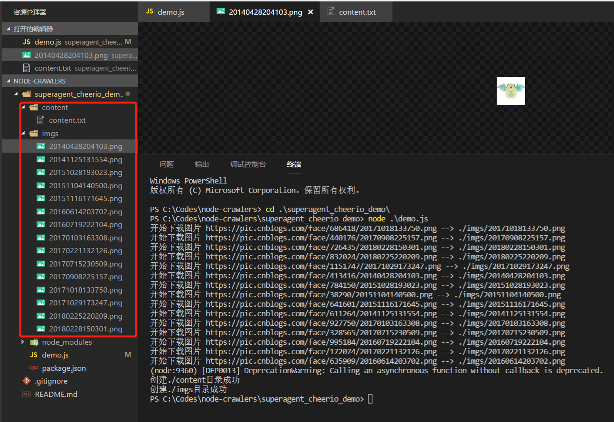

# nodejs爬虫初试

早就听过爬虫，这几天开始学习nodejs，写了个爬虫 demo  ，爬取 博客园首页的文章标题、用户名、阅读数、推荐数和用户头像，现做个小总结。

使用到这几个点：
1. node的核心模块-- [文件系统](http://nodejs.cn/api/fs.html)
2. 用于http请求的第三方模块 -- [superagent](http://visionmedia.github.io/superagent/)
3. 用于解析DOM的第三方模块 -- [cheerio](https://github.com/cheeriojs/cheerio)

几个模块详细的讲解及API请到各个链接查阅，demo中只有简单的用法。

## 准备工作

使用npm管理依赖，依赖信息会存放在`package.json`中

```js
//安装用到的第三方模块
cnpm install --save superagent cheerio
　　引入所需要用到的功能模块

//引入第三方模块，superagent用于http请求，cheerio用于解析DOM
const request = require('superagent');
const cheerio = require('cheerio');
const fs = require('fs');
``` 

## 请求 + 解析页面

想要爬到博客园首页的内容，首先要请求首页地址，拿到返回的html，这里使用**superagent进行http请求**，基本的使用方法如下：
```js
request.get(url)
            .end(error,res){
            //do something          
}
```        

向指定的url发起get请求，请求错误时，会有error返回（没有错误时，error为null或undefined），res为返回的数据。

拿到html内容后，要拿到我们想要的数据，这个时候就需要**用cheerio解析DOM**了，cheerio要先load目标html，然后再进行解析，API和jquery的API非常类似，熟悉jquery上手非常快。直接看代码实例

```js
//目标链接 博客园首页
let targetUrl = 'https://www.cnblogs.com/';

//用来暂时保存解析到的内容和图片地址数据
let content = '';
let imgs = [];

//发起请求
request.get(targetUrl)
       .end( (error,res) => {
           if(error){ //请求出错，打印错误，返回
               console.log(error)
               return;
           }
           // cheerio需要先load html
           let $ = cheerio.load(res.text);
           //抓取需要的数据,each为cheerio提供的方法用来遍历
           $('#post_list .post_item').each( (index,element) => {
               //分析所需要的数据的DOM结构
               //通过选择器定位到目标元素，再获取到数据
                let temp = {
                    '标题' : $(element).find('h3 a').text(),
                    '作者' : $(element).find('.post_item_foot > a').text(),
                    '阅读数' : +$(element).find('.article_view a').text().slice(3,-2),
                    '推荐数' : +$(element).find('.diggnum').text()
                }
                //拼接数据
                content += JSON.stringify(temp) + '\n';
                //同样的方式获取图片地址
                if($(element).find('img.pfs').length > 0){
                    imgs.push($(element).find('img.pfs').attr('src'));
                }
           });
           //存放数据
           mkdir('./content',saveContent);
           mkdir('./imgs',downloadImg);
       })
```
## 存储数据
上面解析DOM之后，已经拼接了所需要的信息内容，也拿到了图片的URL，现在就进行存储，把内容存放到指定目录的txt文件中，而且下载图片到指定目录

先创建目录，使用nodejs核心的文件系统

```js
//创建目录
function mkdir(_path,callback){
    if(fs.existsSync(_path)){
        console.log(`${_path}目录已存在`)
    }else{
        fs.mkdir(_path,(error)=>{
            if(error){
                return console.log(`创建${_path}目录失败`);
            }
            console.log(`创建${_path}目录成功`)
        })
    }
    callback();  //没有生成指定目录不会执行
}
```

有了指定目录之后，可以写入数据了，txt文件的内容已经有了，直接写入就可以了使用`writeFile()`

```js
//将文字内容存入txt文件中
function saveContent() {
    fs.writeFile('./content/content.txt',content.toString());
}
　　取到了图片的链接，所以需要再使用superagent下载图片，存在本地。superagent可以直接返回一个响应流，再配合nodejs的管道，直接把图片内容写到本地

复制代码
//下载爬到的图片
function downloadImg() {
    imgs.forEach((imgUrl,index) => {
        //获取图片名  
        let imgName = imgUrl.split('/').pop();

        //下载图片存放到指定目录
        let stream = fs.createWriteStream(`./imgs/${imgName}`);
        let req = request.get('https:' + imgUrl);  //响应流
        req.pipe(stream);
        console.log(`开始下载图片 https:${imgUrl} --> ./imgs/${imgName}`);         
    } )
}
```
　　执行下demo，看下效果，数据已经正常爬下来了

<div class="img-center">
    
</div>