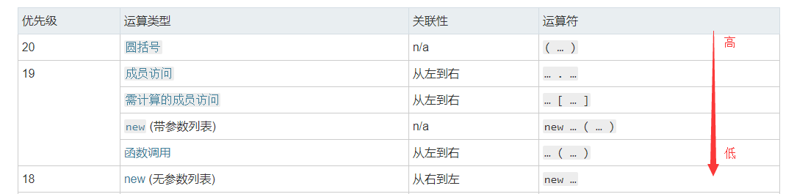
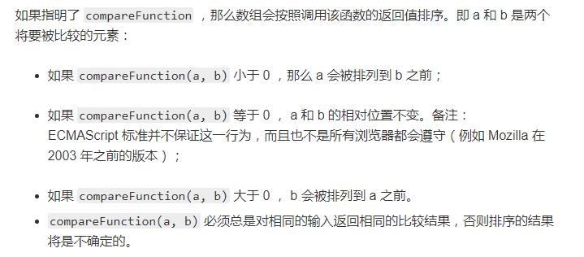

# 面试题集

此页面记录一些看到过的面试题目及分析

## 赋值表达式的返回值结合 this指向 的一道题目

我们都知道`=`是基于右值给左值赋值的操作符。形如`a=b`。

但是这个表达式的返回值是什么呢？打印一下

```js
console.log(x = 100) // 打印为：100
```
可见**返回值就是赋给左边的值**，那么以下问题就比较好分析了

```js
var num = 100;
var obj = {
    num: 200,
    inner: {
        num: 300,
        print: function() {
            console.log(this.num)
        }
    }
};
(obj.inner.print)(); // 300
(obj.inner.print = obj.inner.print)(); // 100
```
`obj.inner.print = obj.inner.print`这个表达式被`()`包裹，会先执行，返回的是`function() {console.log(this.num)}`,再执行。此时就是直接调用，`this`指向`window`。


## 如果处理移动端滑动穿透的问题

在弹框弹起的时候，为document添加touchmove的监听函数，来阻止默认的滚动行为。在弹框收起的时候再移除此监听函数

注意这里不要用匿名函数，不好移除。

```js
    // 弹起时
    //passive为true时，listener中不会调用preventDefault()
    document.addEventListener('touchmove',bodyNoScroll,{passive: false})

    // 收起时
    document.removeEventListener('touchmove',bodyNoScroll);

    function bodyNoScroll(e){
		e.preventDefault();
	}
```

## 处理数值，为每三位数加一个逗号，兼容浮点型数值

以`1234567.1234` 和 `12345678`为例

- 通过内置方法实现

```js
    function addComma(num = 0){
        let temps = num.toString().split('.'), //处理浮点数的情况，整数时会返回原数值
            target = temps[0].split('').reverse(), //倒序
            lastIndex = target.length;
        return target.map((item,index) => { 
                        //第三个就增加一个','，要注意最后一个数字不添加
                        return ((index+1) % 3 === 0 && (index !== lastIndex - 1)) ? (','+ item) : item;
                    })
                    .reverse() //倒序回来
                    .join('') + (temps[1] ? '.' + temps[1] : ''); //如果是浮点数，就再加上小数部分
    }

    addComma(1234567.1234) //1,234,567.1234
    addComma(12345678)     //12,345,678
```

- 通过正则表达式

```js
    function addComma(num = 0){
        let reg = num.toString().indexOf('.') > -1 ? /(\d)(?=(\d{3})+\.)/g : /(\d)(?=(\d{3})+$)/g;

        return num.toString().replace(reg,'$1,');
    }

    addComma(1234567.1234) //1,234,567.1234
    addComma(12345678)     //12,345,678
```
利用正则表达式来处理的思路：
- 整数和浮点数是有差别的，整数从最右边开始算，浮点数要从小数点'.'开始算
- 字符串分为两部分，右边是3*n位数字，左边的部分添加','。n = {1,}

右边的部分很好匹配：`/(\d{3})+/` , 再加上开始算的符号，浮点数要加上 `\.` （`.`匹配除换行符之外的任何单个字符，加上`\.`转义，就是匹配'.'）。整数加上`$`结束符。

左边的部分，必须依赖于右边的部分。比如说必须右边有三位，左边才会匹配成功，加一个','。就需要用到`?=`**正向肯定查找**(`x(?=y)`仅当x后面跟着y时才会匹配x)。`(\d)(?=y)` y就是右边的部分。

**再加上全局搜索的标志 `g`，不然只会匹配一组，只加一个','**。

## typeof null === "object"的原因是什么？

**null** 有时会被当作一种对象类型，但是这其实只是**语言本身的一个bug**，即对 null 执行typeof null 时会返回字符串 object 。 实际上， **null** 本身是基本类型

原理是这样的，不同的对象在底层都表示为二进制，在 JavaScript 中**二进制**前三位都为 0 的话会被判断为 **object** 类型， **null** 的二进制表示是全 0 （语言设计之初是没有null类型的），自然前三位也是 0，所以执行 typeof 时会返回 **object**。


## 为何setTimeout的定时器值推荐最小使用16.7ms ? 

**16.7 = 1000 / 60, 即每秒60帧**

相当一部分的浏览器的显示频率是**16.7ms** , 刷新间隔之前发生了其他绘制请求(setTimeout)，会导致帧丢失，继而导致动画断续显示，这就是过度绘制带来的问题。不仅如此，这种计时器频率的降低也会对电池使用寿命造成负面影响，并会降低其他应用的性能。

用requestAnimationFrame()可以防止这类问题.它能**让动画按照设备绘制间隔来执行**。

> window.requestAnimationFrame() 告诉浏览器——你希望执行一个动画，并且要求浏览器在下次重绘之前调用指定的回调函数更新动画。该方法需要传入一个回调函数作为参数，该回调函数会在浏览器下一次重绘之前执行。


## 分号自动插入机制

判断下以下代码的打印内容是什么？

```js
    function test () {
        return 
        {
            a : 'test'
        }
    }

    test()
```

这里不会返回对象，而是会返回`undefined`。因为JavaScript有自动插入分号的机制，用来修正有缺损的程序。这里因为返回值的表达式的开始部分与`return不`在同一行，所以在return后面插入了一个分号，导致返回了`undefined`。如下
```js
    return;
    {
        a : 'test'
    }
```
把`{`放在`return`同一行就可以避免这个问题了。

详细的插入说明，见MDN[文档](https://developer.mozilla.org/zh-CN/docs/Web/JavaScript/Reference/Lexical_grammar#%E8%87%AA%E5%8A%A8%E5%88%86%E5%8F%B7%E8%A1%A5%E5%85%A8)


## 如何使`(a === 1 && a === 2 && a === 3)`返回`true`

看见这个题目，第一反应就是在变量`a`取值时进行了一些改变，那就要用`getter`

``` js
var temp = 1;
Object.defineProperty(window, 'a', {
    get: function() { // 每次取值，temp+1
        return this.temp++
    }
});

console.log( a === 1 && a === 2 && a === 3); // true
console.log(a) // 4
```

类似的问题是使 `(a == 1 && a == 2 && a == 3)` 返回`true`，不同点是，这里是` == `，而不再是`===`。
::: tip
`===`恒等运算符在比较过程中，不会有任何类型转换；
`==`相等运算符比较宽松，如果两个操作数不是同一类型，那么相等运算符会尝试进行一些类型转换，然后进行比较。转换规则如下：
1. 如果一个是`null`,一个是`undefined`，则它们相等
2. 如果一个是`数字`，一个是`字符串`，先将**字符串转换成数字**，然后使用转换后的值进行比较
3. 如果其中的一个值为`true`，则转换成`1`再进行比较；如果其中一个值为`false`,这转换成`0`再进行比较
4. 如果一个值是对象，另一个值是数字或者字符串，则将**对象转换成原始值**再进行比较。转换成字符串时，会先调用`toString()`，如果没有`toString()`方法或者返回的不是一个原始值，则再调用`valueOf()`，如果还是不存在或者返回不是原始值，则会抛出一个类型错误的异常。返回的原始值会被转换成字符串；如果转换成数字时，也是类似的，不过是会先调用`valueOf()`，再调用`toString()`,返回的原始值会被转换成数字
5. 其他不同类型之间的比较均不相等
:::

回到题目中，除了第一种使用`getter`的思路外，可以将a作为一个对象，而它的在比较中会转换成数字，所以可以重写`valueOf()`方法,在每次取值的时候，进行一些处理。

``` js
let a = {
    temp:1,
    valueOf:function(){
        return this.temp++
    }
}

console.log(a == 1 && a == 2 && a == 3); // true
console.log(a) {temp:4,valueOf: f ()}
```

## new 操作符 做了什么

> new 运算符创建一个用户定义的对象类型的实例或具有构造函数的内置对象的实例。

假设`Test`是一个构造函数，通常在创建对象的实例时，要使用`new`，eg:`test = new Test()` ， 那么在调用`new`的时候，发生了什么呢？

步骤如下：
1. 一个继承自 Test.prototype 的新对象被创建。可以理解为：
```js
    // 创建一个空对象，继承构造函数的prototype（继承公共方法）
    let temp = {};
    temp.__proto__ = Test.prototype
```
2. 使用指定的参数调用构造函数 Test ，并将 this 绑定到新创建的对象。new Test 等同于 new Test()，也就是没有指定参数列表，Test 不带任何参数调用的情况。可以理解为：
```js
    // 绑定this到新创建的对象，执行构造函数（创建实例的成员变量）
    Test.call(temp)
```
3. 由构造函数返回的对象就是 new 表达式的结果。**如果构造函数没有显式返回一个对象，则使用步骤1创建的对象**。（一般情况下，构造函数不返回值，但是**用户可以选择主动返回对象，来覆盖正常的对象创建步骤**）
```js
    //默认情况下，返回最初创建的对象，也可以主动返回对象进行覆盖
    test = temp
```

**如果主动返回的不是对象，则会被无视**，还是使用最初创建的对象

```js
    function Test() {
        return 'test-string'
    }

    console.log(new Test()) // Test {} 返回的是空对象，为Test的实例
```

::: tip
注意：
1. **箭头函数不能作为构造函数**，因为箭头函数没有自己的`this`，所以不可以使用`new`，会报错！
2. **如果构造函数在调用时，没有加`new`操作符**，执行过程中`this`会为`window/undefined`，无法正常生成实例。
:::

## 1 == 2 == 0 为什么会返回 true ? 分析过程

首先 `==`是从左到右结合的，运算结果返回`boolean`，比较的过程中允许发生类型转换。

1. `1==2`返回`false`
2. `false==0`会发生类型转换，`false`自动转换成`0`再进行比较，返回`true`

## 判断以下代码的执行结果（涉及变量提升，函数声明，原型链，this指向，作用域等知识点）

[掘金](https://juejin.im/post/5c6a0fa451882562851b3cdd) 上看到的一个笔试题目，记录并分析总结以下考察点。

```js
  function Foo () {
    getName = function () { alert(1) }
    return this
  }
  Foo.getName = function () { alert(2) }
  
  Foo.prototype.getName = function () { alert(3) }
    
  var getName = function () { alert(4) }

  function getName () { alert(5) }

//判断输出结果
  Foo.getName(); // 2
  getName(); // 4
  Foo().getName(); // 1
  getName(); // 1

  new Foo.getName(); // 2
  new Foo().getName(); // 3
  new new Foo().getName(); //3
```

第一个 不用说什么，直接调用Foo构造函数的getName属性，输出2。

第二个 调用当前作用域下的getName函数，要注意**函数表达式**和**函数声明**的不同：
1. 函数声明会‘被提前’到外部脚本或者外部函数的顶部，所以这种方式声明的函数，可以在它被定义之前的代码中所调用。
2. 函数表达式，就和声明变量一样了，变量声明会提前到顶部，但是赋值会在执行到原位置的时候才进行。
4会变量提升，但是并没有赋值，然后5函数提升（在4赋值之前调用下getName()，输出的是5），而代码执行4的位置时，会赋值就覆盖了5。所以第二个会输出4。

第三个 Foo()执行时，Foo函数体内并没有getName变量，所以就去上一层window下找，重新赋值了window下的getName为输出1（如果没有找到，会在window下创建一个getName），然后返回了this，这里的this指向的是window，再调用window的getName属性，即为重新赋值后的输出1。

第四个 执行当前作用域下的getName,注意此时getName已经重新赋值，所以输出1

第五个 这里需要特别注意表达式的执行顺序，详见 [MDN](https://developer.mozilla.org/zh-CN/docs/Web/JavaScript/Reference/Operators/Operator_Precedence#Table)

<div class="img-center">
    
</div>

`.`比`无参数列表new`执行的优先级高，所以是 `new (Foo.getName)()` 输出2

第六个 同样是执行顺序
`()`比`.`的执行优先级高，所以是 `(new Foo()).getName()`,Foo作为构造函数，指定了返回this，而在构造函数中，this指向的是生成的实例，而Foo中没有对实例添加getName属性，所以在调用实例的getName时，会去Foo.prototype中找，所以输出3

第七个 同样是执行顺序
`new ((new Foo()).getName)()` 是以原型链上的getName为构造函数来执行，输出3

## 算法题目记录 - 多维数组扁平化并去重排序

> **已知如下数组：** 
  `var arr = [ [1, 2, 2], [3, 4, 5, 5], [6, 7, 8, 9, [11, 12, [12, 13, [14] ] ] ], 10];`
  编写一个程序将数组扁平化去并除其中重复部分数据，最终得到一个升序且不重复的数组

1. 扁平化有多种方式：可以将多维数组转化为字符串，然后再`split`为字符串数组 `arr.toString().split(',')` , `new Set(arr)` ； 也可以利用 `Array.flat()` ，这个实验中的 [方法](https://developer.mozilla.org/zh-CN/docs/Web/JavaScript/Reference/Global_Objects/Array/flat) `arr.flat(Infinity)`。

2. 去重 ： 可以利用`Set`的[特性](https://developer.mozilla.org/zh-CN/docs/Web/JavaScript/Reference/Global_Objects/Set)(Set中的元素只会出现一次，即 Set 中的元素是唯一的)，然后再通过 `Array.from()` 将Set 转换为数组 , 同时`Number`将字符串转换为数字

3. 排序 `Array.sort()`没的说

<div class="img-center">
    
</div>

所以如下：

```js
    let arr =  [ [1, 2, 2], [3, 4, 5, 5], [6, 7, 8, 9, [11, 12, [12, 13, [14] ] ] ], 10],
        result;
    
    result = Array.from(new Set(arr.toString().split(',')) , Number).sort( (a,b) => a - b)
    // [1, 2, 3, 4, 5, 6, 7, 8, 9, 10, 11, 12, 13, 14]
```

## 定义一个函数，实现将接收的字符串用空格隔开的功能，并让字符串可以直接调用

处理字符串/数组主要考察的是字符串/数组相关方法的掌握情况。
让字符串可以直接调用，就要注意 原型`prototype`和原型链的相关知识，将函数定义在`String`的原型上，这样所有的字符串都可以通过原型链找到该方法。

```js
    String.prototype.seperate = function(){
        return this.split('').jion(' ');
    }
```

