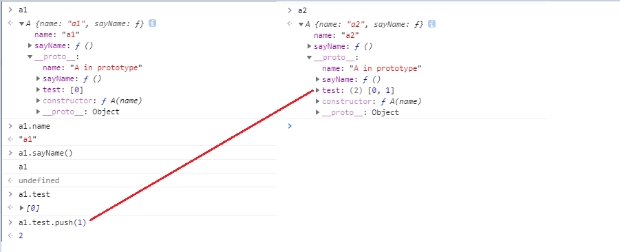
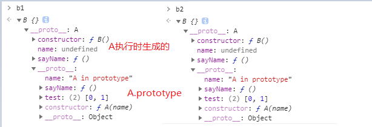
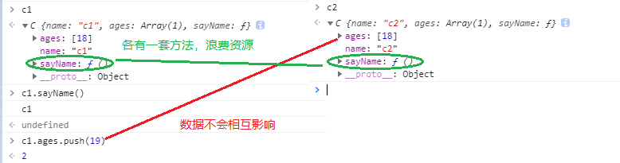
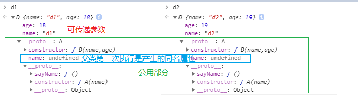
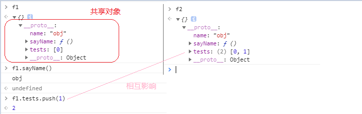
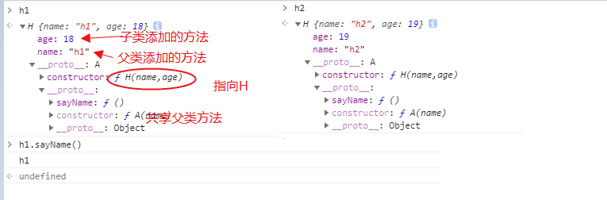
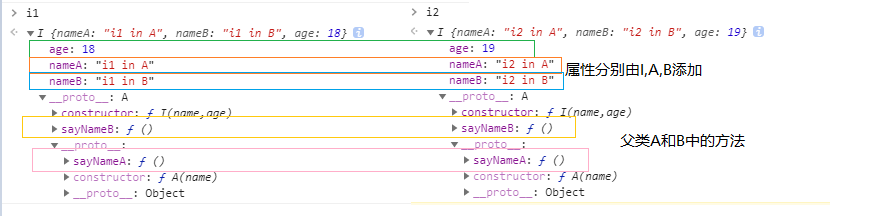

# 继承

### 构造函数和原型

理解JavaScript继承的基础是了解 [原型和原型链](/jsnotes/js-prototype-and-chain.md)。

在了解了原型相关之后，我们知道每个实例在创建的时候都会和一个构造函数的`prototype`对象相关联。并可以通过`__proto__`访问到该对象。

```js
    // 构造函数
    function A(name) {
        this.name = name
        this.sayName = function(){console.log(this.name)}
    }

    // 原型
    A.prototype.name = 'A in prototype'
    A.prototype.test = [0]
    A.prototype.sayName = function(){console.log(this.name + ' in prototype')}

    // 创建实例
    let a1 = new A('a1')
    let a2 = new A('a2')
```
`a1`和`a2` 创建如下图
<div class="img-center">
    
</div>

通过属性和方法执行结果我们可以看出：

+ 在构造函数`A` 执行时，为实例`a1``a2`添加了属性和方法，并且**可以传递参数**
+ 实例`a1``a2`都会和`A.prototype`相关联（`new 操作符实现的`），可以访问到其中的属性和方法
+ 实例`a1``a2`会优先访问自身的属性或方法，当自身存在时就不会访问`A.prototype`上的
+ `A.prototype`是所有实例**共享**的，实例对`A.prototype`引用类型的属性进行更改时，会相互影响

`原型`和`构造函数`是继承中的重要角色，无论实现的技巧有何不同，但终归要使用到这两个知识点。

## 原型链继承

利用原型链不断向上索引的特性，修改之类的原型为父类的实例，可以实现继承。

```js
    function B() {// ...}

    // B的原型为A的一个实例
    // A执行时，可能会生成一些属性和方法
    // [B的实例] => B.prototype/[A的实例] => A.prototype  B继承了A的方法
    B.prototype = new A()
    // constructor设为B
    B.prototype.constructor = B

    let b1 = new B()
    let b2 = new B()
```

<div class="img-center">
    
</div>

此种方式存在的问题：
+ 父类是共享的，实例对引用类型的属性会相互影响 eg: A.prototype.test；
+ 无法向父类的构造函数中传递参数，在修改子类原型时，父类实例就已经被创建了

## 借用构造函数

在构造函数执行时，会为实例添加属性/方法，所有可以采用`借用构造函数`（父类的构造函数在子类内部调用）的方法实现继承，可以解决上一种方式的两个问题。

```js
// 在A的构造函数中增加一个引用类型的属性验证子类实例的数据是否互通
function A(name) {
    this.name = name
    this.ages = [18]
    this.sayName = function(){console.log(this.name)}
}

function C(name) {
    // 调用父类A的构造函数，并传入参数
    // 此处的this为子类实例，所以会在子类实例上添加父类的属性
    A.call(this,name)
}   

let c1 = new C('c1')
let c2 = new C('c2')
```

<div class="img-center">
    
</div>

可以传递参数，实例的属性不会相互影响。但是创建时会为每一个实例都添加一套方法，很浪费资源，而且不能继承到父类原型上的方法和属性，只能继承父类自己的方法和属性

## 组合继承

前面两种方式各有优劣，且可以互补，组合起来就是比较好的一种继承方式。用原型来继承需要共享方法/属性，构造函数来继承父类的属性

```js
function A(name) {
    this.name = name
}

A.prototype.sayName = function(){console.log(this.name)}

function D(name,age) {
    // 继承A中的属性，传递参数
    A.call(this,name)
    this.age = age
}

// 继承父类原型上的方法
D.prototype = new A()
D.prototype.constructor = D

let d1 = new D('d1',18)
let d2 = new D('d2',19)
```

<div class="img-center">
    
</div>

可以传递参数，父类中的属性不会相互影响，是独立的，父类原型中的方法是公用的。但是有两个缺点：父类构造函数执行了两次，而且第二次执行生成实例充当之类原型时，会生成一份额外的属性（此部分属性在之类实例中已生成一份，不会被访问到）

## 原型继承

把已有的对象当作原型来创建构造函数，这样就可以继承到对象上的属性和方法，不用创建自定义的父类。

```js
// 要共享的数据和方法
const obj = {
    name:'obj',
    tests:[0],
    sayName:function(){
        console.log(this.name)
    }
}

// 原型继承的代码
function createObject(obj) {
    function F(){}
    F.prototype = obj
    return F;
}

// 生成之类和它的实例
let E = createObject(obj),
    e1 = new E(),
    e2 = new E();
```

这种方式和原型链继承类似，不过不再是通过父类实例充当之类的`prototype`，而是通过已有对象。也存在共享的数据会相互影响的问题。

### Object.create()

这种继承方式，可以用`object.create()`实现，此方法的[详细介绍](https://developer.mozilla.org/zh-CN/docs/Web/JavaScript/Reference/Global_Objects/Object/create)
```js
let f1 = Object.create(obj),
    f2 =  Object.create(obj);
```
<div class="img-center">
    
</div>

## 寄生继承

在原型继承的基础上，对已有的对象进行加强，就是寄生继承。

```js
let G = createObject(obj)
// 增强，为之类添加自定义的方法
G.eat = function(){console.log('eat')}
```

这种方式不能复用之类的方法，每个之类都要自己有一份，和构造函数继承是类似的问题

## 寄生组合继承

之前介绍的组合继承，最大的问题就是父类构造函数执行了两次，效率降低，而且第二次执行产生了属性/方法都是无用的。在指定子类原型时采用`寄生`的方式，不再调用第二次父类构造函数，就解决这个上述问题。

```js
// 父类
function A(name) {
    this.name = name
}
// 父类原型
A.prototype.sayName = function(){console.log(this.name)}


// 子类
function H(name,age){
    // 构造函数继承 - 为子类实例添加父类的属性
    A.call(this,name)
    // 子类属性
    this.age = age
}

// 寄生继承 
//以父类原型为基础创建一个纯净的对象，避免父类构造函数第二次调用
H.prototype = Object.create(A.prototype)
//进行增强，修改constructor指向 
H.prototype.constructor = H

/** 可以直接设置好constructor，上面写法只是为了强调有更改constructor这个步骤
H.prototype = Object.create(A.prototype,{
    constructor: { value: H, writable: true, configurable: true }
})
**/

let h1 = new H('h1',18)
let h2 = new H('h2',19)

```
<div class="img-center">
    
</div>

此时的实现的继承解决了组合继承的缺点，相对完美了

+ 可以向父类构造函数传递参数
+ 子类实例共享父类原型上的方法
+ 子类实例生成了父类和子类上的属性，不会共享
+ 父类构造函数只执行了一次，没有额外的开销，也不会生成无用的属性

## 继承多个对象

需要继承多个对象时，可以在子类构造函数中**执行多个父类的构造函数**，在指定子类原型时**混合多个父类原型的方法**

```js
// 父类1
function A(name) {
    this.nameA = name + ' in A'
}
// 父类原型1
A.prototype.sayNameA = function(){console.log(this.nameA)}

// 父类2
function B(name) {
    this.nameB = name + ' in B'
}
// 父类原型2
B.prototype.sayNameB= function(){console.log(this.nameB)}


function I(name,age) {
    // 执行多个父类的构造函数添加属性
    A.call(this,name)
    B.call(this,name)
    this.age = age
}

I.prototype = Object.create(A.prototype)
// 混合父类的原型
Object.assign(I.prototype,B.prototype)

I.prototype.constructor = I

let i1 = new I('i1',18)
let i2 = new I('i2',19)
```

<div class="img-center">
    
</div>