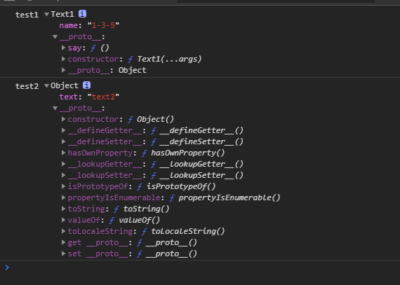

# new 操作符 的理解和实现

## new 操作符 做了什么

> new 运算符创建一个用户定义的对象类型的实例或具有构造函数的内置对象的实例。

假设`Test`是一个构造函数，通常在创建对象的实例时，要使用`new`，eg:`test = new Test()` ， 那么在调用`new`的时候，发生了什么呢？

步骤如下：
1. 一个继承自 Test.prototype 的新对象被创建。可以理解为：
```js
    // 创建一个空对象，继承构造函数的prototype（继承公共方法）
    let temp = {};
    temp.__proto__ = Test.prototype
```
2. 使用指定的参数调用构造函数 Test ，并将 this 绑定到新创建的对象。new Test 等同于 new Test()，也就是没有指定参数列表，Test 不带任何参数调用的情况。可以理解为：
```js
    // 绑定this到新创建的对象，执行构造函数（创建实例的成员变量）
    Test.call(temp)
```
3. 由构造函数返回的对象就是 new 表达式的结果。**如果构造函数没有显式返回一个对象，则使用步骤1创建的对象**。（一般情况下，构造函数不返回值，但是**用户可以选择主动返回对象，来覆盖正常的对象创建步骤**）
```js
    //默认情况下，返回最初创建的对象，也可以主动返回对象进行覆盖
    test = temp
```

**如果主动返回的不是对象，则会被无视**，还是使用最初创建的对象

```js
    function Test() {
        return 'test-string'
    }

    console.log(new Test()) // Test {} 返回的是空对象，为Test的实例
```

::: tip
注意：
1. **箭头函数不能作为构造函数**，因为箭头函数没有自己的`this`，所以不可以使用`new`，会报错！
2. **如果构造函数在调用时，没有加`new`操作符**，执行过程中`this`会为`window/undefined`，无法正常生成实例。
:::

## 如何自己实现一个 new 操作符

在上面介绍的基础上，对`new`操作符的作用和执行过程过程有了一定的理解。实现起来也就很简单了

```js
        function Create(constructor,...args) {
            // 创建新对象
            let obj = {};
            // 指定新对象的原型为 构造函数的prototype属性
            Object.setPrototypeOf(obj,constructor.prototype)
            // 执行构造函数，并将this绑定未创建的新对象
            let result = constructor.call(obj,...args);

            // 如果构造函数有返回对象则直接返回，否则返回创建的新对象
            return result instanceof Object ? result : obj;
        }
```

通过两个例子验证一下

```js
        // 无返回对象
        function Text1(...args) {
            this.name = args.join('-');
        }

        // 有返回对象
        function Text2(...args) {
            this.name = args.join('-');

            return {
                text: 'text2'
            }
        }

        Text1.prototype.say = Text2.prototype.say = function(){
            console.log(this.name)
        }

        let test1 = Create(Text1,1,3,5);
        let test2 = Create(Text2,1,3,5);

        console.log("test1", test1)
        console.log("test2", test2)
```

执行结果如下：

<div class="img-center">
    
</div>

text1的构造函数Text1无返回对象，所以它是创建过程中，新创建的对象，原型指向`Text1.prototype`
text2的构造函数Text2中有返回对象，所以它为直接创建出来的对象，原型指向`Object.prototype`

说明我们的自定义函数是成功的