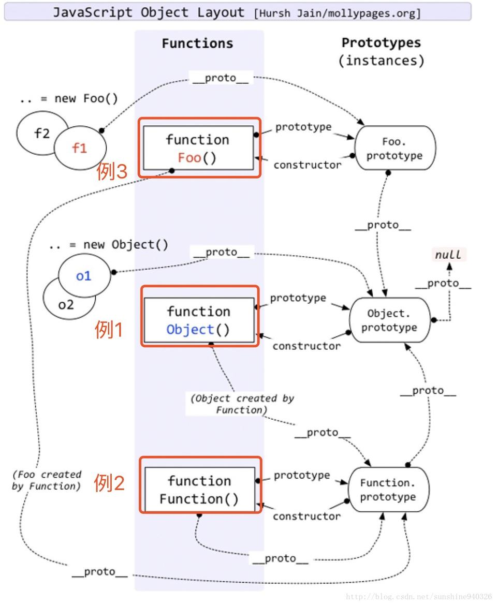

# 原型和原型链

在javaScript中，经常会说到**原型**（`prototype`）和**原型链**（`prototype chain`）。我曾经以为我完全理解了，但是后来总是会发现不同的地方，这次进行一次系统的整理。

## 原型

### 什么是原型？

看一下*权威指南*中的说明
> 每一个javaScript对象（null除外）都和另一个对象相关联。“另一个”对象就是我们熟知的原型，**每一个对象都从原型继承属性**。

如果是通过关键字`new`和`构造函数(constructor)`调用创建的对象，比如`let x = new Date()`，此时`x`的原型就是**constructor**的**prototype**属性。

如果是通过对象直接量创建的对象的时候，比如`let y = {}`。此时的`y`会和`Object.prototype`相关联。

如果是通过`Object.create()`创建的对象，比如`let z = Object.create(obj)`。此时`z`的原型就是它的第一个参数`obj`（也可以是null）。

```js
 let x = new Date(),
     y1 = {},
     y2 =[],
     obj = {a:1},
     z = Object.create(obj);

 Object.getPrototypeOf(x) === Date.prototype // true
 Object.getPrototypeOf(y1) === Object.prototype // true
 // 注意这里是数组
 Object.getPrototypeOf(y2) === Array.prototype // true
 Object.getPrototypeOf(z) === obj // true

```
可以在浏览器调试工具中打印下`Object.prototype`究竟是什么样，会看到很多常见的方法。

上面都是内置构造函数，自定义的函数也是一样

```js
 function Test(){
     console.log('constructor Test');
 }

 let test =  new Test();

 Object.getPrototypeOf(test) === Test.prototype // true
```

实例在被创建的时候，就已和自己的原型相关联。原型指向constructor的prototype，当然也可以是指定的对象。那么如此重要的一个特性是做什么的呢？简单来说，是**用来实现继承**的。

### 原型有什么作用呢？

思考一个简单的问题，定义一个对象`let x = {a:1}`。`x`中没有定义任何方法，但是却可以使用一些方法（比如：`toString`），那么这些方法来自哪里呢？

```js
 let x = {a:1},
     y = new String('123');
// toString继承自Object.prototype
 x.toSting() // "[object Object]"

// split继承自String.prototype
y.split('') // ["1", "2", "3"]
```

实例对象的原型中会有公共的方法，每个实例都可以访问到，这样无需再重复实现，也就是**继承**。所以JavaScript中的继承，**不是通过复制而来的，而是通过原型继承的**，而访问的过程，就是所谓的“**原型链**”了。

我们可以把需要实例继承的方法定义在它的原型上。

```js
 function Test(){
 }

 Test.prototype.sayHi = function(){
     console.log('Hi world!')
 }

 let test1 =  new Test();
 let test2 =  new Test();

 // 实例使用原型上的方法
 test1.sayHi() // 'Hi world!'
 test2.sayHi() // 'Hi world!'
```

## 原型链

> 每个实例对象（ `object` ）都有一个私有属性（可称之为 `__proto__` ）指向它的构造函数的原型对象（`prototype` ）。该原型对象也有一个自己的原型对象( `__proto__` ) ，层层向上直到一个对象的原型对象为 `null`。根据定义，`null` 没有原型，并作为这个原型链中的最后一个环节。

::: tip
    __proto__ 是JavaScript 的非标准属性，但许多浏览器都已实现。
:::

以上面的对象为例进行分析：对`x={a:1}`这个对象调用`toString`方法，在`x`对象中没有找到此方法，就会去`x.__proto__`指向的原型对象（也就是Object.prototype对象）中找，在Object.prototype中找到了`toString`，就调用了。如果调用`x.aa()`方法，`x`自身没有，`x.__proto__`中也没有，再往上一层`x.__proto__.__proto__`发现是`null`（`Object.prototype.__proto__ === null`）了，在自身和原型链中都没有找到，就会报错了。

实例对象在创建的时候就和原型对象相关联，除了`__proto__`这个非标准属性外，可以通过以下方法访问原型对象。

+ `Object.getPrototypeOf()` 方法返回指定对象的原型（内部[[Prototype]]属性的值）。
+ `Object.setPrototypeOf()` 方法设置一个指定的对象的原型 ( 即, 内部[[Prototype]]属性）到另一个对象或  null。
+ `isPrototypeOf()` 方法用于测试一个对象是否存在于另一个对象的原型链上。` prototypeObj.isPrototypeOf(object)`

除了`isPrototypeOf`外还可以使用`instanceof`来判断原型链关系。这两种方法都是只要原型对象出现在实例的原型链中，就会返回true。不过需要注意一个判断的原型对象，一个判断是构造函数。以上面的示例进行判断

```js
    test1 instanceof Test // true
    test1 instanceof Object // true
    test1 instanceof Array // false

    Test.prototype.isPrototypeOf(test1) // true
    Object.prototype.isPrototypeOf(test1) // true
```

### `__proto__` 和 `prototype`属性

要注意区分`__proto__`和`prototype`：

+ `__proto__`是实例对象的私有属性，指向它的构造函数的`prototype`属性
+ `prototype`是构造函数的属性，在调用构造函数创建实例对象时，实例对象通过`__proto__`和`prototype`相关联。同样的，**`prototype`对象中会有`__proto__`，指向它自己的原型，这样一层层链接，直到指向`null`，形成原型链**
+ 构造函数都是`Function`的实例
+ 函数默认有`prototype`属性，是定义公共方法的地方；`prototype`中有`constructor`属性，是指向函数本身。

```js
    // Test为构造函数，函数默认有原型对象 Test.prototype
    function Test(){};
    // x为Test的实例
    let x = new Test();
    
    // x的原型链为：x -> Test.prototype -> Object.prototype -> null
    x.__proto__ === Test.prototype; // true
    x.__proto__.__proto__ === Object.prototype; // true
    x.__proto__.__proto__.__proto__ === null; // true
    
    //Test.prototype中有constructor指向构造函数
    Test.prototype.constructor === Test // true

    x.constructor === Test // true  注意，这里用的是x原型（Test.prototype）中的属性

    // 构造函数也算是Function的实例
    // Test的原型链为：Test -> Function.prototype -> Object.prototype -> null
    Test.__proto__ === Function.prototype // true
    Test.__proto__.__proto__ === Object.prototype // true

    // 内置的构造函数也都算是Function的实例
    Array.__proto__ === Function.prototype // true
    Date.__proto__ === Function.prototype // true
    Function.__proto__ === Function.prototype // true
    Object.__proto__ === Function.prototype // true
```

简单来说，就是构造函数中有prototype属性，prototype属性中有contructor字段指向构造函数，当使用构造函数创建实例时，实例中会有`__proto__`指向原型，也就是构造函数的prototype属性，这样在实例就可以访问到原型中的属性和方法。

最后放一张网图来总结下

<div class="img-center">
    
</div>