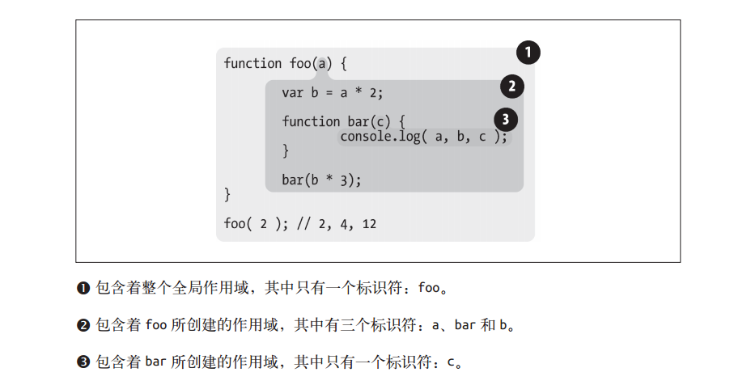

# 作用域相关概念

## 什么是作用域？

程序离不变量，那么变量存储在哪里？程序需要时如何找到他们？

这些问题说明需要一套设计良好的**规则**来存储变量， 并且之后可以方便地找到这些变量。这套规则被称为**作用域**。

作用域负责收集并维护由所有声明的标识符（变量） 组成的一系列查询， 并实施一套非常严格的规则， 确定当前执行的代码对这些标识符的访问权限。

## 作用域嵌套

当一个块或函数嵌套在另一个块或函数中时， 就发生了作用域的嵌套。 因此， 在当前作用域中无法找到某个变量时， 引擎就会在外层嵌套的作用域中继续查找， 直到找到该变量，或抵达最外层的作用域（也就是全局作用域） 为止。

```js
function foo(a) { 
console.log( a + b ); // foo的作用域中没有变量b，去外层找
}
var b = 2;
foo( 2 ); // 4

```

## 词法作用域

刚学的时候就知道JavaScript是**词法作用域**，那么究竟是什么意思？

JavaScript的源代码在执行之前会在编译器中经历词法分析、语法分析、代码生成等环节。

词法化的过程会对源代码中的字符进行检查，如果是有状态的解析过程，还会赋予单词语义。**词法作用域是由你在写代码时将变量和块作用域写在哪里决定的**，因此当词法分析器处理代码时会保持作用域不变。

词法作用域意味着作用域是由书写代码时函数声明的位置来决定的。编译的词法分析阶段基本能够知道全部标识符在哪里以及是如何声明的，从而能够预测在执行过程中如何对它们进行查找。

<div class="img-center">
    
</div>

作用域气泡由其对应的作用域块代码写在哪里决定， 它们是逐级包含的。


## 欺骗词法

正常情况下，词法作用域完全由写代码期间函数所声明的位置来定义。但是JavaScript也有两种机制可以在运行的时候来“修改”（也可以说欺骗）词法作用域。`eval()`和`with`。

JavaScript 引擎会在编译阶段进行数项的**性能优化**。其中有些优化依赖于能够根据代码的词法进行静态分析，并预先确定所有变量和函数的定义位置，才能在执行过程中快速找到标识符。但如果引擎**在代码中发现了 eval(..) 或 with**，它只能简单地假设关于标识符位置的判断都是无效的，因为无法在词法分析阶段明确知道 eval(..) 会接收到什么代码，这些代码会如何对作用域进行修改，也无法知道传递给 with 用来创建新词法作用域的对象的内容到底是什么。那么所有的优化可能都是无意义的，因此最简单的做法就是**完全不做任何优化**。

如果代码中大量使用 eval(..) 或 with ，那么运行起来一定会变得非常慢。无论引擎多聪明，试图将这些悲观情况的副作用限制在最小范围内，也无法避免如果没有这些优化，**代码会运行得更慢**这个事实。

## 提升

先看个小栗子

```js
    console.log(a)
    var a = 2;
```
直觉上认为，`JavaScript`是从上而下一行一行执行的，应该会报错`ReferenceError`. 但实际上这里会输出`undefined`.

引擎会在解释 JavaScript 代码之前首先对其进行编译。编译阶段中的一部分工作就是找到所有的声明，并用合适的作用域将它们关联起来。**包括变量和函数在内的所有声明都会在任何代码被执行前首先被处理**。

所以上述栗子可以理解为
```js
    var a;
    console.log(a); // undefined
    a = 2;
```
**定义在编译阶段进行，赋值留在原地等待执行阶段**，这个过程就叫做**提升**。

需要注意的是：

1. 函数声明会被提升，但是函数表达式不会被提升

```js
    foo1(); // 'foo1'
    foo2(); // TypeError : foo2 is not a function  此处的foo2未被赋值，为undefined

    function foo1(){
        console.log('foo1');
    }
    var foo2 = function (){
        console.log('foo2');
    }

```

2. 函数会首先被提升，然后才是变量

```js
    foo(); //foo1  而不是TypeError 说明函数声明先被提升，然后才是变量提升，但是同名，所以变量的声明被忽略了

    var foo = function (){
        console.log('foo2');
    }

    function foo(){
        console.log('foo1');
    }

    foo(); //foo2 执行赋值之后，foo函数输出foo2
```

## 闭包

