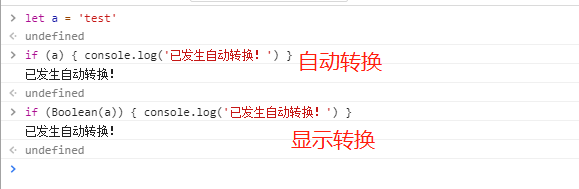

# 那些不经意间发生的数据类型自动转换

JavaScript可以自由的进行**数据类型转换**，也提供了多种显式转换的方式。但是更多的情况下，是由JavaScript自动转换的，当然这些转换遵循着一定的规则，了解数据类型自由转换的规则是非常必要的。再次翻阅犀牛书后有了一些总结，记录一下。

## 数据类型

聊到数据类型转换，就不得不提到JavaScript的数据类型：原始类型（`Number` , `String` , `Boolean` , `undefined` ,  `null` ,  `Symbol`），对象类型 （Object）。当然Object有可以细分出 Array , Date , RegExp等对象。

既然分为这么多种数据类型，每种数据类型肯定会有特定的用途，那么当提供的值的数据类型与预期不符时要怎么办呢，比如我需要在控制语句中使用到 boolean 值，提供的值却是 string 。当然我们可以显式转换 Boolean( a : string) ，但是根据日常经验，我们知道其实不需要这么复杂，可以在控制语句中直接用这个string类型的变量 ，也可以达到预期的效果。如下：

<div class="img-center">
    
</div>

可见自动转换方便很多，但是在这个过程中到底是按照什么规则处理的呢？

## 自动转换

### 什么时候会发生自动转换呢 ？

犀牛书上是这样描述的： 
> 当JavaScript期望使用一个布尔值的时候，你可以提供任意类型值，JavaScript将根据需要自行转换类型。一些值（真值）转换为true ， 一些值（假值）转换为false 。这在其他类型中同样适用：如果JavaScript期望使用一个字符串，它把给定的值转换为字符串。如果JavaScript期望一个数字，它把给定的值转换为数字（如果转换结果毫无意义的话，将会返回NaN）。

简而言之就是：==JavaScript有一些语句/运算符对数据类型有要求，但我们提供的与预期不符时，就会发生自动类型转换==。

### 对数据类型有期待的语句和表达式

1. 期待`boolean`类型的 ： if 语句 、 do while 语句 、 while do 语句 、 &&  ||   ！ （与或非逻辑表达式）  、 ? : （ 三目运算符）

2. 期待`number`类型的 ：  + - * / % （算数运算符） 、  ++  --  （增量/减量运算符） 、 > 、  >= 、 <  、 <= 数字比较

3. 期待`string`的： + （字符串连接） 、 > 、  >= 、 <  、 <=  字母排序比较

4. 特殊的 : ==  、 !=  (不)相等运算符，在检测两个操作数是否相等时，会进行类型转换；（注意 ：  === 、!==  是（不）严格相等运算符，是不会进行类型转换的）

::: warning
1中当然可以传入表达式，但是表达式返回的结果也肯定会返回boolean类型的值，或者返回值被转换为boolean；2和3有一些重复的运算符 ： + 、 > 、  >= 、 <  、 <= ，这些运算符在不同场景下发生自动转换的时候，会有不同的优先级。
:::

```js
// + 的场景   +有两种作用：算数运算和字符串连接。所以期待的是数字和字符串！
// 1、两个操作数同为数字，或者同为字符串，不需要进行转换
1 + 1   // 2  
'1' + '1'  // '11'  
// 2、有一个操作数是字符串，则另外一个也会转换为字符串
'1' + 1   // "11"
'1' + null   //  "1null"
'1' + {}   //  "1[object Object]"
'1' + new Date()  //  "1Wed Jun 20 2018 11:49:55 GMT+0800 (中国标准时间)"
// 3、如果有一个操作数是对象的话，会转化为原始值（除了Date对象是调用toString()方式转换 ， 其他对象都会调用 valueOf() 进行转换 ， 但是由于多数对象只是简单的继承了valueOf() , 只会返回对象，而不是一个原始值，所以会再调用toString进行转换） ， 所以这里可以简单的理解为：都会转换为字符串 。 另一个操作数也会转换为字符串
1 + {}   // "1[object Object]"
1 + new Date()  //  "1Wed Jun 20 2018 11:56:56 GMT+0800 (中国标准时间)"
1 + []   //  "1"
// 4、 其他情况都会转换为数字
1 + null  // 1
1 + undefined   // NaN
```

**从例子中可以看到，==\+ 的转换其实是优先转换为字符串的==，如果操作数中又字符串或者对象（对象在这里会转换为字符串），则会按照 字符串连接进行操作的。从例子的第3个可以看到，第一个操作数都是数字，但是会转化为字符串。例子中的第4个，没有对象和字符串，null 和 undefined 都转换为 数字进行算数运算，其中undefined -> number 会返回 NaN , 所以计算结果为NaN。**

“+”还有特殊的用法，就是转换为数字，如下。会将+后的操作数转换为数字，具体的转换规则后续会说明。

```js
+ null   //  0
+ undefined  //  NaN
+ {}  //  NaN
+ new Date()  //  1529467646682
+ ["5"]  //  5
+ "4"  //  4
```

 ==> 、  >= 、 <  、 <=  这些比较运算符的规则和 + 类似，不过是会优先转换为数字进行比较==

```js
// 作用 ： 比较数值大小或者再字母表中的位置。也是期待数字和字符串！
// 1、两个操作数中只要有一个不是字符串，则两个值都转为数字
 "3" > "11"    //  true   字符串比较
  3 > "11"      // false   11 转换为数字
　true > '0'    // true true 和 ‘0’ 都转换为数字 
//2、对象同样会转换为原始值（不过这里的Date对象也是优先调用valueOf ,返回的是毫秒数，其他的和上述 + 的一样），如果转换后有一个字不是字符串，则两个值也都需要转换为数字
1000 > new Date()  // false
100000000000000000000000 > new Date()  //  true   date对象转换为数字
"100000000000000000000000" > new Date()  //  true  左值也随着 date对象一起转换为数字
'11' > ["3"]  //  false  数组转为字符串，所以这里是字符串比较
```
::: warning
这里需要注意的是，只要在转换为数字的过程中，有一个值是NaN，那么比较的结果肯定是false。
:::

==\== 、 !=  （不）相等运算符是不严格的比较，所以，如果两个操作数不是同一类型，那么会尝试进行一些类型转换，然后进行比较==。有以下规则和类型转换：

1. 一个值是undefined，一个值是null，则相等
2. 一个值是数字，一个值是字符串，则字符串转换为数字进行比较
3. true 和 false 会分别转换为 1 和 0 
4. 一个值是字符串或者数字，另一个是对象，对象转换为原始值（Date类只调用toString，其他的和之前的一致），然后进行比较。
5. 其他的比较，全是false。
```js
null == undefined  // true  1
null == 0    //  false  5
1 == '1'  //  true   2
1 == true  //  true  3 
2 == true  //  false  3
1 == [1]  // true  4
'1' == ['1']  // true  4   数组转为字符串
1 == ['1']  //  true  4  数组转为字符串再转为数字
```
　　
还有一种自动转换也很容易被忽略，但是经常见到。那就是对象包装 

**思考一个问题，为什么数字是原始类型，却可以使用toString方法？ 只有对象才会有方法的，为什么数字却可以使用。**

```js
let x = 1
x.toString()  //   "1"
``` 

因为在x需要使用方法的时候，JavaScript会通过调用 `new Number(x)` 的方式将它暂时转换为对象，它继承了Number对象的方法，所以就可以调用toString了。同样的还有字符串、布尔值，也是通过各种的构造函数进行转换。这也是为什么undefined和null，不可以使用toString的原因，因为它们没有构造函数。

```js
x = null
x.toString()
//VM289:1 Uncaught TypeError: Cannot read property 'toString' of //null
//   at <anonymous>:1:3
//(anonymous) @ VM289:1


x = undefined
x.toString()

//VM305:1 Uncaught TypeError: Cannot read property 'toString' of //undefined
//    at <anonymous>:1:3
```

目前我所了解的自动转换就只有这么多，后续再继续补充。那么自动转换的过程中，又有哪些规则呢？

 

## any -> boolean

　　在其他类型的值转换为boolean是，只有这几个会转换为false，其他都是true ： undefined 、 null 、 "" 、 0 、-0 、NaN。

```js
Boolean(0)  //  false
Boolean("") //false
Boolean(NaN)  //false
Boolean(undefined)  //false
Boolean(null)  // false

// 空对象 空数组 空函数 都会true
Boolean({})  // true
Boolean([])   //true
Boolean(function () {})   // true

// 此时是一个boolean对象，而不是原始值，所以是true
Boolean(new Boolean(false))  // true
```
 

## any -> number

在其他类型的值转换为number是，就复杂一些：

1. boolean -> number 

　　　　true ->  1

　　　　false -> 0

2. string -> number

　　　　由数字组成的字符串，可以直接转换为数字，开始和结尾的空格都可以忽略。不符合的字符串会返回NaN。

```js
+''   //  0  空字符串
+'100'   //  100
+'   100  '   //  100 忽略前后空格
+'   100aa'  //  NaN   有其他非数字
```
::: tip
备注：这里的规则是自动转换的规则，如果是显示转换的话，构造函数`Number()` 和此规则一致，而`window.parseInt()`  `window.parseFloat`的解析规则则不一样。如下

```js
window.parseInt('  100a  ')   //  100
window.parseFloat(' 100.11a') // 100.11
```
:::

3. 对象 -> number

**对象会先尝试调用 valueOf 返回原始值，如果没有则调用toString返回原始值，再进行转换返回**。看几个例子

```js
+new Date()  //  1529483712712  date对象的valueOf返回毫米数，即为数字
+[]  //  0   数组valueOf为它自己，再调用toString 返回 “” ，空字符串转换为数字为0
+['1']  //  1  同样toString  返回 “1” ， 转换为数字为 1
+['1','2']  // NaN  toString 返回 “1，2”  转换为数字 NaN
+{}  //  NaN   toString [Object,Object] , 转换为数字 NaN
```

4. undefined  null 

　　　　null -> 0

　　　　undefined -> NaN


## any -> string

1. null undefined boolean  number
    
这几个原始类型的转换非常简单，就是将自身用引号包裹而已。

```js
'' + 1  //  "1"
'' + true  //  "true"
'' + undefined  //  "undefined"
'' + null  //   "null"
```
2. 对象 -> string 

和对象转化为数字类似，不过是先调用toString，在调用valueOf。

```js
'' + {}  //   "[object Object]"
'' + []   //  ""
'' + [1,2,3]  //  "1,2,3"
'' + function() {}  //  "function () {}"
'' + new Date()  //  "Wed Jun 20 2018 16:50:56 GMT+0800 (中国标准时间)"
```

可以看出不同的对象差别挺大的，**数组会将每个元素用逗号分开，生成字符串，date对象toString返回的是中国标准时间，从这里就可以看过和转化成数字的不同逻辑了，先尝试toString  不行才再valueOf。**

自动类型转换真的非常常见，常用的一些便捷的转类型的方式，都是依靠自动转换产生的。比如 转数字 ： + x    、  x - 0  ，   转字符串 ：   "" + x  等等。现在总算知道为什么可以这样便捷转换。