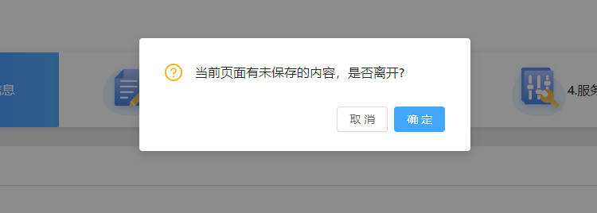

# react相关记录

此页记录遇到过的react相关问题

## react-router

### 如何在路由切换时，进行 是否确认离开 的提示？

`react-router` 版本 `^5.1.2`

在有正在编辑的内容未保存时，发生了路由切换，此时需要给出一些提示，并由用户控制是否进行跳转。

在`react-router`进行路由管理时，可以使用 `Prompt` 组件实现此功能，其中的`message`属性可以接受一个函数，返回`string`的时候就提示，默认为window.confirm进行提示，用户可以选择是否跳转；返回`true`的时候就直接路由切换，不进行提示。

可以将`Prompt`进行简单的封装，如下：

```js
import { Prompt} from "react-router-dom";

export default function RouterPrompt ({message,promptBoolean}) {
    // Will be called with the next location and action the user is attempting to navigate to. Return a string to show a prompt to the user or true to allow the transition.
    return  <Prompt message={
                        location =>
                            !promptBoolean
                            ? true
                            : message || '当前页面有未保存的内容，是否离开?'
                    }
            />
}
```

使用的时候，哪个组件需要在离开时进行提示，引入一下就行，可以放在组件的任意位置。是否需要提示由使用者自己控制。

```js
            <div className="hardware">
                {/* 这里是根据输入框的编辑状态来设置是否需要提示 */}
                <RouterPrompt promptBoolean={EDIT_STATUS}></RouterPrompt>
                {/* 其他内容 */}
            </div>
```

提示默认使用的是`window.confirm`，但还可以通过`getUserConfirmation`进行自定义。

```js
import { HashRouter as Router} from "react-router-dom";
import { Modal} from 'antd';

// message 就是window.confirm的message，通过callback控制是否通过
// 这里直接使用antd的Modal组件
customConfirm = (message,callback) => {
    Modal.confirm({
        title:message,
        onCancel: () => {
            callback(false);
            },
            onOk: () => {
            callback(true);
            }
    })
}
<Router getUserConfirmation={customConfirm}></Router>
```

效果如下：



### <Link\> 打开新的页面 

`Link`支持 a 标签的属性。You can also pass props you’d like to be on the \< a > such as a title, id, className, etc. 传入`target="_blank"`可以在新页面打开路由。

我使用的版本为 **5.1.2** ，可以实现预期。但是旧版本的react-router可能无法打开新页面。此时可以用`window.open(url)`来实现。

```js
    <Link to="/messageCenter" target="_blank">
```

### 路由切换时如何传递参数

1、通过URL直接传递参数 /test/:id , 可以通过 `match.params` 解析到，新增的`useParams`可以更便捷的获取

2、通过state传递。 通过history中的push/replace改变路由时，可以额外传递参数，在history.location.state中解析

```js
        history.replace({
            pathname: '/account/login',
            state:{
                [name]: 'something'
            }
        })
```

## Ant Design

### 减少moment的语言包体积

只打包中文资源包

```js
    new webpack.ContextReplacementPlugin(
      /moment[/\\]locale$/,
      /zh-cn/,
    )
```

### inputNumber控件 限制只能输入整数

[InputNumber控件API](https://ant.design/components/input-number-cn/#API)

`formatter` 和 `parser` 配合使用，可以通过自定义函数的方式限制输入格式

```js
    // formatter parser 传入自定义函数
    <InputNumber  max={max}
                    min={min}
                    formatter={limitToInt}
                    parser={limitToInt}
                    onChange={value => this.paramChangeHandle('paramMaxValue',value)} 
                    value={paramMaxValue} style={{width:"70px"}}></InputNumber>


    // 限制输入值为整数
    function limitToInt (value) {
        // eslint-disable-next-line no-useless-escape
        const reg = /^(\-)?(\d*)\.*$/;

        if (value === '-') {
            return value
        }

        if (isNaN(+value)) {
            return '';
        }

        return ('' + value).replace(reg,'$1$2')
    }
```

### Form控件，getFieldDecorator中自定义校验规则

用`getFieldDecorator`包装的控件，除了提供的校验规则外，有两种添加自定义规则的方式

+ pattern 

传入一个正则表达式

```js
    {getFieldDecorator('password', {
        rules: [{ required: true, message: '请输入账号密码' },
                { pattern: /^[a-zA-Z]\w{5,17}$/ , message: '密码要求是以字母开头的6到18个字母或数字或下划线'}],
        initialValue: ''    
    })(<Input.Password placeholder="设置您的登录密码" />)}
```

+ validator

传入一个自定义校验函数

```js

    {getFieldDecorator('passwordComfirm', {
        rules: [{ required: true, message: '请确认账号密码' },
                { validator: this.compareToFirstPassword}],
        initialValue: ''
    })(<Input.Password placeholder="请再次输入登录密码" />)}

    compareToFirstPassword = (rule, value, callback) => {
        const { form } = this.props;
        // 比对密码
        if (value && value !== form.getFieldValue('password')) {
            callback('两次密码输入必须一致');
        } else {
            callback();
        }
    }
```