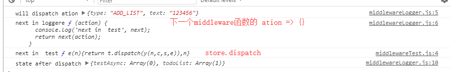

# redux源码学习笔记 - applyMiddleware

在创建store时，`createStore(reducer, preloadedState, enhancer)`，除了reducer函数，初始状态，还可以传入`enhancer`。这个enhancer在createStore的源码中是这样使用的
```js
    return enhancer(createStore)(reducer, preloadedState)
```
它可以接受createStore方法并进行**自定义改装**，然后再使用改装后的方法创建仓库。

而redux官方提供的enhancer就只有`applyMiddleware`。

## applyMiddleware(...middlewares)

applyMiddleware的主要功能是改写createStore中的`dispatch`方法，并且**可以将多个middleware组合到一起，形式链式的调用，前后互不影响**。这样要求middleware必须遵循一定的格式。` ({ getState, dispatch }) => next => action => {}`

### applyMiddleware的实现

```js
export default function applyMiddleware(...middlewares) {
  // 返回一个enhancer函数，接受createStore作为参数（可以对照enhancer的调用方式来看）
  return createStore => (...args) => { // enhancer函数接受reducer, preloadedState来创建仓库
    const store = createStore(...args)
    // 自定义dispatch函数，在构造middleware的时候，不允许调用dispatch
    let dispatch = () => {
      throw new Error(
        `Dispatching while constructing your middleware is not allowed. ` +
          `Other middleware would not be applied to this dispatch.`
      )
    }

    const middlewareAPI = {
      getState: store.getState, // store中的getState函数，用于获取状态
      dispatch: (...args) => dispatch(...args) // 自定义的dispatch函数
    }
    // 传入到getState，和dispatch到middleware中 生成 next => action => {} 格式的函数
    const chain = middlewares.map(middleware => middleware(middlewareAPI))

    // 自定义的dispatch更新为 多个middleware的组合函数；传入store原本dispatch函数给组合函数（会在最后一个middle中作为next函数）
    dispatch = compose(...chain)(store.dispatch)

    // 返回store仓库，此时的dispatch函数已被改写，为多个middleware的组合函数
    return {
      ...store,
      dispatch
    }
  }
}
```

### 组合和链式调用

关键是要理解这里`dispatch = compose(...chain)(store.dispatch)`,dispatch被改写为多个middleware的组合函数。

compose函数中关键的一句是`return funcs.reduce((a, b) => (...args) => a(b(...args)))`

a可以理解为`next => action => {}`,而`next`可以理解为`b(...args)` 就是下一个middleware的 `ation => {}` 函数。所以实现了链式调用。a中做了自定义的操作，会调用b，b调用c···最后一个调用`store.dispatch`。

用两个middleware做例子来梳理改写后的`dispatch(action)`的调用过程。

## 自定义middleware

middleware必须遵循一定的格式。` ({ getState, dispatch }) => next => action => {}`

{getState, dispatch}参数是在applyMiddleware的源码中`const chain = middlewares.map(middleware => middleware(middlewareAPI))`这一部分被传入的，store的getState和改写后的dispatch。

**next是下一个middleware或者store.dispatch**，action是触发的动作

```js
/*logger*/
export default ({dispatch,getState}) => next => action => {
    // 做一些自定义的事情
    console.log('will dispatch ation',action);
    console.log('next in loggere',next);

    // 调用下一个middleware
    let returnValue = next(action);

    console.log('state after dispatch',getState());

    return returnValue;
}
```
```js
/*test*/
export default ({dispatch,getState}) => next => action => {
        
    console.log('next in  test',next)

    return next(action);
}
```

使用applyMiddleware
`store = createStore(reducer,applyMiddleware(logger,test))`
触发action时，有如下打印


logger做完自定义操作后，调用下一个middleware（test）函数，test是最后一个middleware，它的next是store.dispatch，就触发了action。
